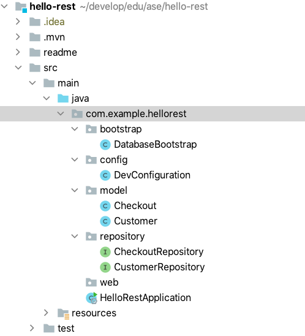

# Database-Bootstrap: Add a record to the database

[Go to database-bootstrap branch](https://github.zhaw.ch/bacn/ase2-spring-boot-hellorest/tree/database-bootstrap)

##  Project Structure for Database-Bootstrap

Create the packages config and bootstrap:

<br/>



<br/>

### Class DatabaseBootstrap

<br/>

```java
import com.example.hellorest.model.Customer;
import com.example.hellorest.repository.CustomerRepository;
import org.slf4j.Logger;
import org.slf4j.LoggerFactory;
import org.springframework.beans.factory.InitializingBean;
import org.springframework.beans.factory.annotation.Autowired;

public class DatabaseBootstrap implements InitializingBean {
    @Autowired
    CustomerRepository repository;
    private static Logger log = LoggerFactory.getLogger(DatabaseBootstrap.class);

    @Override
    public void afterPropertiesSet() throws Exception {
        if (repository.findByFirstnameAndLastname("Felix", "Muster") == null) {
            Customer customer = new Customer();
            customer.setFirstname("Felix");
            customer.setLastname("Muster");
            repository.save(customer);
            log.info(customer.getFirstname() + " " + customer.getLastname() +
                    " created");
        }
        log.info("Bootstrap finished");
    }

}

```

<br/>

### Class DatabaseBootstrap

<br/>

```java
import com.example.hellorest.bootstrap.DatabaseBootstrap;
import org.springframework.context.annotation.Bean;
import org.springframework.context.annotation.Configuration;


/**
 * Defines a Bean for the DatabaseBootstrap
 */
@Configuration
public class DevConfiguration {

    @Bean
    public DatabaseBootstrap databaseBootstrap() {
        return new DatabaseBootstrap();
    }

}

```

<br/>


###  Change the unit test CustomerRestControllerTest

<br/>

```java
    @Test
    public void getCustomersList() throws Exception {
        String uri = "/customers";
        MvcResult mvcResult = mvc.perform(MockMvcRequestBuilders.get(uri)
                .accept(MediaType.APPLICATION_JSON_VALUE, "application/hal+json")).andReturn();

        int status = mvcResult.getResponse().getStatus();
        assertEquals(200, status);
        String response = mvcResult.getResponse().getContentAsString();

        String content = extractEmbeddedFromHalJson(response,"customers");
        Customer[] customerList = super.mapFromJson(content, Customer[].class);
        assertTrue(customerList.length > 0);
        assertEquals(customerList[0].getFirstname(), "Felix");
        assertEquals(customerList[1].getFirstname(), "Felix");

    }
```
