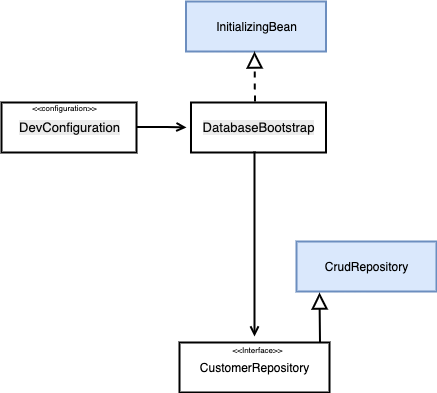

# Database-Bootstrap: Add a record to the database

| [master](master.md)
| [database-bootstrap]()
| [flyway](flyway.md)
| [liquibase](liquibase.md)
| [profiles](profiles.md)
| [docker](docker.md)
| [rest](rest.md)
| [security-step-1](security-step-1.md)
| [security-step-2]()
|


[Go to database-bootstrap branch](https://github.zhaw.ch/bacn/ase2-spring-boot-hellorest/tree/database-bootstrap)

Spring Boot makes it really easy to manage our database changes in an easy way.
If we leave the default configuration, it'll search for entities in our packages and create
the respective tables automatically.

But sometimes we'll need some finer grained control over the database alterations. We have the following options:

- use the _data.sql_ and _schema.sql_ files (database dependant)
- add own _database bootstrap classes_ to insert data to the database

The tutorial consists of the following steps:

- [Add a class DatabaseBootstrap](#class-databasebootstrap).
- [Add a class DevConfiguration](#class-devconfiguration).
- [Change the unit test CustomerRestControllerTest](#change-the-unit-test-customerrestcontrollertest).

The design class diagramm shows how the configuration class _DevConfiguration_ is creating an instance to the _DatabaseBootstrap_
class. The database bootstrap is running as soon as the life cycle event _afterPropertiesSet_ is firing.

<br/>



<br/>

##  Project Structure for Database-Bootstrap

Create the packages config and bootstrap:

<br/>


<br/>

### Class DatabaseBootstrap

The _DatabaseBootstrap_ class is implementing the spring life cycle events through the interface _InitializingBean_.


<br/>

```java
import com.example.hellorest.model.Customer;
import com.example.hellorest.repository.CustomerRepository;
import org.slf4j.Logger;
import org.slf4j.LoggerFactory;
import org.springframework.beans.factory.InitializingBean;
import org.springframework.beans.factory.annotation.Autowired;

public class DatabaseBootstrap implements InitializingBean {
    @Autowired
    CustomerRepository repository;
    private static Logger log = LoggerFactory.getLogger(DatabaseBootstrap.class);

    @Override
    public void afterPropertiesSet() throws Exception {
        if (repository.findByFirstnameAndLastname("Felix", "Muster") == null) {
            Customer customer = new Customer();
            customer.setFirstname("Felix");
            customer.setLastname("Muster");
            repository.save(customer);
            log.info(customer.getFirstname() + " " + customer.getLastname() +
                    " created");
        }
        log.info("Bootstrap finished");
    }

}

```

<br/>

### Class DevConfiguration

The class _DevConfiguration_ contains a **@Bean** _databaseBootstrap_, which creates an instance of _DatabaseBootstrap_.

<br/>

```java
import com.example.hellorest.bootstrap.DatabaseBootstrap;
import org.springframework.context.annotation.Bean;
import org.springframework.context.annotation.Configuration;


/**
 * Defines a Bean for the DatabaseBootstrap
 */
@Configuration
public class DevConfiguration {

    @Bean
    public DatabaseBootstrap databaseBootstrap() {
        return new DatabaseBootstrap();
    }

}

```

<br/>


###  Change the unit test CustomerRestControllerTest

The _CustomerRestControllerTest_ is adapted to the new data loaded from the database.

<br/>

```java
    @Test
    public void getCustomersList() throws Exception {
        String uri = "/customers";
        MvcResult mvcResult = mvc.perform(MockMvcRequestBuilders.get(uri)
                .accept(MediaType.APPLICATION_JSON_VALUE, "application/hal+json")).andReturn();

        int status = mvcResult.getResponse().getStatus();
        assertEquals(200, status);
        String response = mvcResult.getResponse().getContentAsString();

        String content = extractEmbeddedFromHalJson(response,"customers");
        Customer[] customerList = super.mapFromJson(content, Customer[].class);
        assertTrue(customerList.length > 0);
        assertEquals(customerList[0].getFirstname(), "Felix");
        assertEquals(customerList[1].getFirstname(), "Felix");

    }
```
