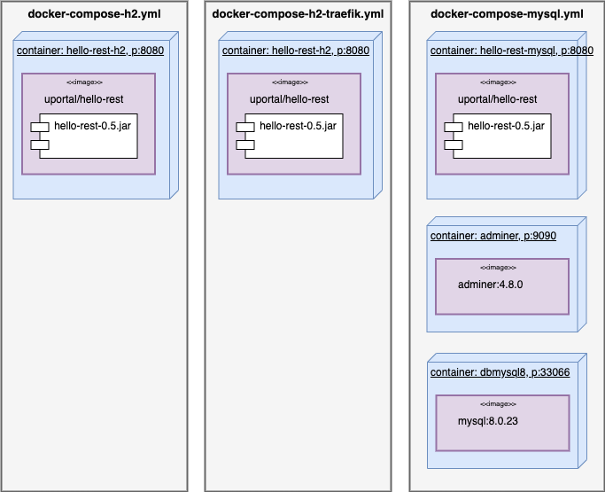
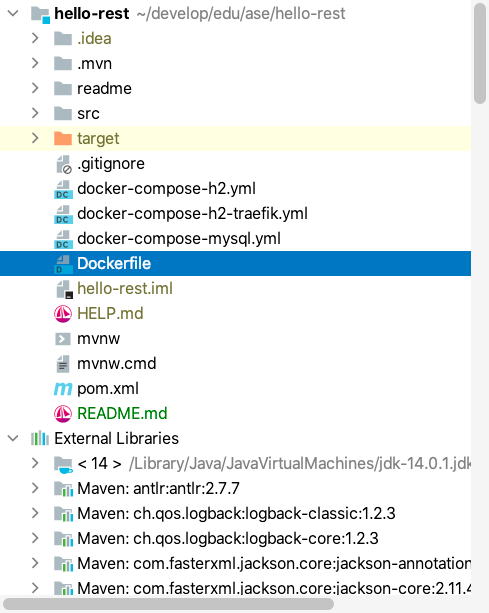

# Docker: Create a docker container and docker-compose files for different setups


| [master](master.md)
| [database-bootstrap](database-bootstrap.md)
| [flyway](flyway.md)
| [liquibase](liquibase.md)
| [profiles](profiles.md)
| [docker]()
| [rest](rest.md)
| [security-step-1](security-step-1.md)
| [security-step-2](security-step-2.md)
|


[Go to docker branch](https://github.zhaw.ch/bacn/ase2-spring-boot-hellorest/tree/docker)

The **docker branch** has been created from the **profiles** branch.

The tutorial shows how to build containers with different configurations:

<br/>



<br/>

The illustration shows the goal of this tutorial:

- docker-compose-h2.yml: an image of _hello-rest_ containing the _jar_ file _hello-rest.0.5.jar_ running in a container _hello-rest-h2_.
- docker-compose-h2-traefik.yml: an image of _hello-rest_ containing the _jar_ file _hello-rest.0.5.jar_ running in a container _hello-rest-h2_ including the labels of the reverse proxy _traefik_.
- docker-compose-mysql.yml: an image of _hello-rest_ containing the _jar_ file _hello-rest.0.5.jar_ running in a container _hello-rest-mysql_ including a mysql database and an _adminer database manager_.

<br/>

The tutorial consists of the following steps:

- [Build run and publish the hello-rest project](#build-run-and-publish-the-hello-rest-project).
- [Create a Docker Container, Run and Publish to Docker](#create-a-docker-container-run-and-publish-to-docker).
- [Create a Dockerfile](#create-a-dockerfile).
- [Create a docker-compose-h2.yml file](#create-a-docker-compose-h2yml-file).
- [Create a docker-compose-mysql.yml file](#create-a-docker-compose-mysqlyml-file).
- [Create a docker-compose-h2-traefik.yml file](#create-a-docker-compose-h2-traefikyml-file).


##  Project Structure for Supporting different container setups

We can see the new files like Dockerfile, docker-compose-h2.yml, docker-compose-mysql.yml, docker-compose-h2-traefik.yml.

<br/>



<br/>

## Build run and publish the hello-rest project

Use a Mac, Linux, WSL2 or git bash console.

<br/>

```
git clone https://github.zhaw.ch/bacn/ase2-spring-boot-hellorest
cd file-system-storage
git checkout docker
./mvnw clean package
java -jar target/hello-rest*.jar
```

<br/>

##  Create a Docker Container, Run and Publish to Docker

Create first a jar with the build instruction. The create a container. Replace **uportal** with your **dockerhub id**.

<br/>

```

$  docker build -t uportal/hello-rest .
$  docker run -p 8080:8080 --rm -it  uportal/hello-rest
```

<br/>

Ctrl c will stop and delete the container.

<br/>

Replace **uportal** with your **dockerhub id**.

<br/>

```
$  docker login
$  docker login --username uportal --password 
$  docker push uportal/hello-rest
```
<br/>

login to deployment platform with a container infrastructure:

<br/>

Replace **uportal** with your **dockerhub id**.

<br/>

```
$  docker pull uportal/hello-rest
```

<br/>

##  docker-compose

Start the files with:

<br/>

Start with log output in the console

```
$  docker-compose -f docker-compose-h2.yml up
```

<br/>

Start in detached mode

```
$  docker-compose -f docker-compose-h2.yml up -d
```

<br/>

Delete containers:

```
$  docker-compose -f docker-compose-h2.yml rm
```

<br/>

### Create a Dockerfile

The Dockerfile takes a slim _JDK11 image_, adds the _hello-rest jar_ file from the _target_ folder with the name _app.jar_. This jar file is started by _java -jar_ command.

<br/>

```dockerfile
FROM openjdk:11-jdk-slim

ADD target/hello-rest*.jar app.jar

ARG JVM_OPTS
ENV JVM_OPTS=${JVM_OPTS}

CMD java ${JVM_OPTS} -jar app.jar

```

<br/>

### Create a docker-compose-h2.yml file

The _docker-compose-h2.yml_ contains one service with the name _hello-rest-h2_. The environment variables are used for defining the application name and with active spring profiles.

Replace **uportal** with your **dockerhub id**.

<br/>

```yaml

version: '2'

services:

  hello-rest-h2:
    image: uportal/hello-rest:latest

    restart: always
    environment:
      APP_NAME: Hello Rest with H2
      ACTIVE_PROFILES: dev,h2
    ports:
      - 8080:8080

```

<br/>

### Create a docker-compose-mysql.yml file

The _docker-compose-h2.yml_ contains three services:

- hello-rest-mysql: our hello-rest spring application listening at the host port 8080
- adminer: a database manager for the mysql database listening at the host port 9090
- dbmysql8: a mysql database instance listening at the host port 33066


Replace **uportal** with your **dockerhub id**.

<br/>

```yaml
version: '3'

services:

  hello-rest-mysql:
    image: uportal/hello-rest:latest

    restart: always
    environment:
      APP_NAME: Hello Rest with MySQL
      ACTIVE_PROFILES: dev,mysql
      APP_DB_HOST: dbmysql8-hellorestdb
      APP_DB_PORT: 3306
      APP_DB_NAME: hellorest
      APP_DB_USERNAME: root
      APP_DB_PASSWORD: hellorest
    ports:
      - 8080:8080

  adminer:
    image: adminer:4.8.0
    restart: always
    ports:
      - 9090:8080
    environment:
      ADMINER_DEFAULT_SERVER: dbmysql8-hellorestdb

  dbmysql8:
    image: mysql:8.0.23
    command: --default-authentication-plugin=mysql_native_password
    container_name: dbmysql8-hellorestdb
    restart: always
    cap_add:
      - SYS_NICE
    environment:
      MYSQL_DATABASE: 'hellorest'
      # So you don't have to use root, but you can if you like
      MYSQL_USER: 'user'
      # You can use whatever password you like
      MYSQL_PASSWORD: 'hellorest'
      # Password for root access
      MYSQL_ROOT_PASSWORD: 'hellorest'
    ports:
      # <Port exposed> : < MySQL Port running inside container>, host port for using with mysql-workbench or dbeaver
      - '33066:3306'
    expose:
      # Opens port 3306 on the container
      - '3306'
      # Where our data will be persisted
    volumes:
      - dbmysql8-hellorestdb:/var/lib/mysql
# Names our volume
volumes:
  dbmysql8-hellorestdb:

```

<br/>

### Create a docker-compose-h2-traefik.yml file

The _docker-compose-h2.yml_ contains one service with the name _hello-rest-h2_. The environment variables are used for defining the application name and with active spring profiles.
The service registers at the _traefik reverse proxy_ and is available under the url: _hello-rest-h2.united-portal.com_.

Replace **uportal** with your **dockerhub id**.

<br/>

```yaml
version: '2'


networks:
  proxy:
    external: true

services:

  hello-rest-h2:
    image: uportal/hello-rest:latest
    labels:
      - "traefik.backend=hello-rest-h2"
      - "traefik.frontend.rule=Host:hello-rest-h2.united-portal.com"
      - "traefik.docker.network=proxy"
      - "traefik.port=8080"
      - "traefik.enable=true"

    restart: always
    networks:
      - proxy
    environment:
      APP_NAME: Hello Rest with H2
      ACTIVE_PROFILES: dev,h2


```

<br/>
