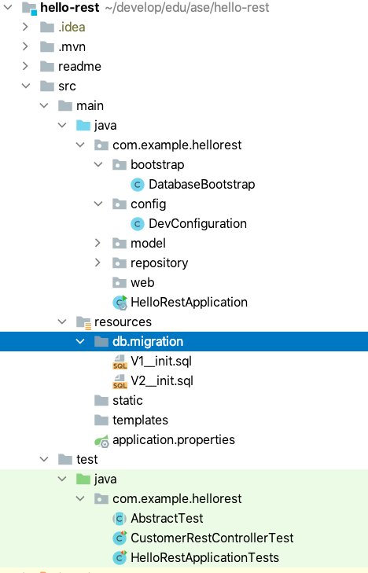

# Flyway: Do a Database Migration


| [master](master.md)
| [database-bootstrap](database-bootstrap.md)
| [flyway]()
| [liquibase](liquibase.md)
| [profiles](profiles.md)
| [docker](docker.md)
| [rest](rest.md)
| [security-step-1](security-step-1.md)
| [security-step-2](security-step-2.md)
|


[Go to flyway branch](https://github.zhaw.ch/bacn/ase2-spring-boot-hellorest/tree/flyway)

Database migration — in the context of enterprise applications — is an important process to update
production databases to the current software release.

Database migration means also moving your data from one platform to another.
There are many reasons you might want to move to a different platform.

Flyway is an open-source database migration tool. It strongly favors simplicity and convention over configuration.
It is based around just 7 basic commands: Migrate, Clean, Info, Validate, Undo, Baseline and Repair.

With Flyway all changes to the database are called migrations. Migrations can be either versioned or repeatable.  
Versioned migrations come in 2 forms: regular and undo.

[https://flywaydb.org/](https://flywaydb.org/)

<br/>

The tutorial consists of the following steps:

- [Project Structure for Flyway Migration](#project-structure-for-flyway-migration).
- [Add a Dependency to flyway-core](#add-a-dependency-to-flyway-core).
- [Migration file V1__init.sql](#migration-file-v1__initsql).
- [Migration file V2__init.sql](#migration-file-v2__initsql).
- [Add new flyway configurations to application.properties](#add-new-flyway-configurations-to-applicationproperties).
- [Change the unit test CustomerRestControllerTest](#change-the-unit-test-customerrestcontrollertest).


<br/>

##  Project Structure for Flyway Migration

Create in the resource folder a directory db/migration

<br/>



<br/>

### Add a Dependency to flyway-core

Spring boot is automatically configuring the flyway component.

<br/>

Add this dependency to your pom file:

<br/>

```xml
      <dependency>
         <groupId>org.flywaydb</groupId>
         <artifactId>flyway-core</artifactId>
      </dependency>
```

<br/>

### Migration file V1__init.sql

The migration file _V1__init.sql_ is creating the _CUSTOMER_ and _CHECKOUT_ table. The file has to
be created in the _resources_ folder _db/migration_.

<br/>

```sql
CREATE TABLE CUSTOMER (
                          id BIGINT GENERATED BY DEFAULT AS IDENTITY,
                          firstname varchar(255) not null,
                          lastname varchar(255) not null
);
CREATE TABLE CHECKOUT (
                          id BIGINT GENERATED BY DEFAULT AS IDENTITY,
                          customer_id BIGINT
);

```

<br/>

### Migration file V2__init.sql

The migration file _V2__init.sql_ is creating the CUSTOMER and CHECKOUT table.

<br/>

```sql
insert into CUSTOMER (firstname, lastname) values ('Max', 'Mustermann');
```

<br/>

### Add new flyway configurations to application.properties

We must add 3 new configuration properties for flyway:
```
spring.flyway.baseline-on-migrate = true
spring.flyway.schemas=PUBLIC
spring.jpa.properties.hibernate.id.new_generator_mappings=false
```

<br/>

The _application.properties_ file after adding the new properties:

<br/>

```
spring.jpa.hibernate.ddl-auto=none
spring.jpa.database-platform=org.hibernate.dialect.H2Dialect
spring.datasource.driverClassName=org.h2.Driver
# spring.datasource.url=jdbc:h2:file:./database;FILE_LOCK=FS
spring.datasource.url=jdbc:h2:mem:testdb
spring.datasource.username=sa
spring.datasource.password=
spring.h2.console.enabled=true


springdoc.swagger-ui.path=/swagger-ui.html

# spring.flyway.url = jdbc:h2:mem:testdb
spring.flyway.baseline-on-migrate = true
spring.flyway.schemas=PUBLIC
spring.jpa.properties.hibernate.id.new_generator_mappings=false

springdoc.version= @springdoc.version@
```


<br/>


###  Change the unit test CustomerRestControllerTest

We need to adjust the expected results in the _CustomerRestControllerTest_ class.

<br/>

```java

import static org.junit.jupiter.api.Assertions.assertTrue;
import static org.junit.jupiter.api.Assertions.assertEquals;

import com.example.hellorest.model.Customer;
import com.example.hellorest.repository.CustomerRepository;
import org.junit.jupiter.api.BeforeEach;
import org.junit.jupiter.api.Test;
import org.springframework.beans.factory.annotation.Autowired;
import org.springframework.http.MediaType;
import org.springframework.test.web.servlet.MvcResult;
import org.springframework.test.web.servlet.request.MockMvcRequestBuilders;

public class CustomerRestControllerTest extends AbstractTest {

    @Autowired
    CustomerRepository customerRepository;

    Customer customer1;
    Customer customer2;

    @Override
    @BeforeEach
    public void setUp() {
        super.setUp();
        customer1= new Customer();
        customer1.setFirstname("Felix");
        customer1.setLastname("Mustermann");
        customerRepository.save(customer1);
        customer2= new Customer();
        customer2.setFirstname("Max");
        customer2.setLastname("Mustermann");
        customerRepository.save(customer2);
    }

    @Test
    public void getCustomersList() throws Exception {
        String uri = "/customers";
        MvcResult mvcResult = mvc.perform(MockMvcRequestBuilders.get(uri)
                .accept(MediaType.APPLICATION_JSON_VALUE, "application/hal+json")).andReturn();

        int status = mvcResult.getResponse().getStatus();
        assertEquals(200, status);
        String response = mvcResult.getResponse().getContentAsString();

        String content = extractEmbeddedFromHalJson(response,"customers");
        Customer[] customerList = super.mapFromJson(content, Customer[].class);
        assertTrue(customerList.length > 0);
        assertEquals(customerList[0].getFirstname(), "Max");
        assertEquals(customerList[1].getFirstname(), "Felix");

    }

    @Test
    public void getOneCustomer() throws Exception {
        String uri = "/customers/1";
        MvcResult mvcResult = mvc.perform(MockMvcRequestBuilders.get(uri)
                .accept(MediaType.APPLICATION_JSON_VALUE, "application/hal+json")).andReturn();

        int status = mvcResult.getResponse().getStatus();
        assertEquals(200, status);
        String response = mvcResult.getResponse().getContentAsString();
        Customer customer = super.mapFromJson(response, Customer.class);
        assertEquals(customer.getFirstname(), "Max");
    }

    @Test
    public void postOneCustomer() throws Exception {
        String uri = "/customers";

        Customer customer= new Customer();
        customer.setFirstname("John");
        customer.setLastname("Doe");

        String json = super.mapToJson(customer);

        MvcResult postMvcResult = mvc.perform(MockMvcRequestBuilders.post(uri)
                .accept(MediaType.APPLICATION_JSON_VALUE, "application/hal+json")
                .content(json))
                .andReturn();

        int status = postMvcResult.getResponse().getStatus();
        assertEquals(201, status);
        String response = postMvcResult.getResponse().getContentAsString();
        Customer postCustomer = super.mapFromJson(response, Customer.class);
        assertEquals(postCustomer.getFirstname(), customer.getFirstname());
    }

}

```
