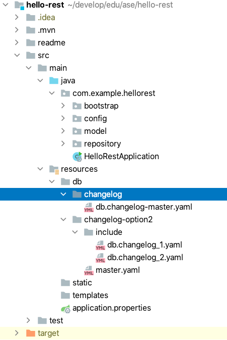
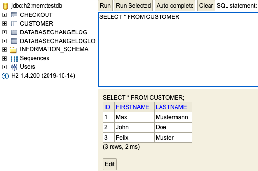
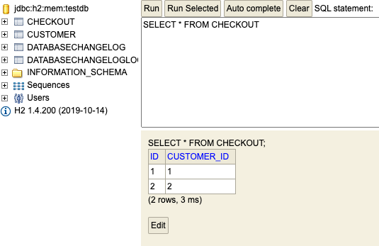

# Liquibase: Do a Database Migration

[Go to liquibase branch](https://github.zhaw.ch/bacn/ase2-spring-boot-hellorest/tree/liquibase)

The **liquibase branch** has been created from the **database-bootstrap** branch and not from the flyway branch.

##  Project Structure for Liquibase Migration

Create in the resource folder a directory db/changelog and db/changelog-option2

<br/>


<br/>

### add a dependency

<br/>

Add a dependency to your pom file. Make sure, the **flyway dependency** is **not** in the pom file:

<br/>

```xml
      <dependency>
         <groupId>org.liquibase</groupId>
         <artifactId>liquibase-core</artifactId>
         <version>4.3.1</version>
      </dependency>
```

<br/>

### application.properties

<br/>

```
spring.jpa.hibernate.ddl-auto=none
spring.jpa.database-platform=org.hibernate.dialect.H2Dialect
spring.datasource.driverClassName=org.h2.Driver
spring.datasource.url=jdbc:h2:mem:testdb
spring.datasource.username=sa
spring.datasource.password=
spring.h2.console.enabled=true

springdoc.swagger-ui.path=/swagger-ui.html

springdoc.version= @springdoc.version@

# spring.liquibase.change-log=classpath:/db/changelog/db.changelog-master.yaml
spring.liquibase.change-log=classpath:/db/changelog-option2/master.yaml

spring.jpa.open-in-view=false
spring.jpa.properties.hibernate.id.new_generator_mappings=false

```


<br/>

### Create a master.yaml file in the folder db/changelog-option2

<br/>

```yaml
databaseChangeLog:

    - includeAll:
        path: include
        relativeToChangelogFile: true
```

<br/>

### Create a db.changelog_1.yaml file in the folder db/changelog-option2/include

<br/>

```yaml
databaseChangeLog:
  - changeSet:
      id: 1
      author: matthiasbachmann
      changes:
        - createTable:
            tableName: customer
            columns:
              - column:
                  name: id
                  type: bigint
                  autoIncrement: true
                  constraints:
                    primaryKey: true
                    nullable: false
              - column:
                  name: firstname
                  type: varchar(255)
                  constraints:
                    nullable: false
              - column:
                  name: lastname
                  type: varchar(255)
                  constraints:
                    nullable: false
        - createTable:
            tableName: checkout
            columns:
              - column:
                  name: id
                  type: bigint
                  autoIncrement: true
                  constraints:
                    primaryKey: true
                    nullable: false
              - column:
                  name: customer_id
                  type: bigint
  - changeSet:
      id: 2
      author: matthiasbachmann
      changes:
        - insert:
            tableName: customer
            columns:
              - column:
                  name: firstname
                  value: Max
              - column:
                  name: lastname
                  value: Mustermann


```

<br/>

### Create a db.changelog_2.yaml file in the folder db/changelog-option2/include

<br/>

```yaml
databaseChangeLog:
  - changeSet:
      id: 3
      author: matthiasbachmann
      changes:
        - insert:
            tableName: customer
            columns:
              - column:
                  name: firstname
                  value: John
              - column:
                  name: lastname
                  value: Doe

  - changeSet:
      id: 4
      author: matthiasbachmann
      changes:
        - insert:
            tableName: checkout
            columns:
              - column:
                  name: customer_id
                  value: 1

  - changeSet:
      id: 5
      author: matthiasbachmann
      changes:
        - insert:
            tableName: checkout
            columns:
              - column:
                  name: customer_id
                  value: 2

```

<br/>


###  Change the unit test CustomerRestControllerTest

<br/>

```java
import static org.junit.jupiter.api.Assertions.assertTrue;
import static org.junit.jupiter.api.Assertions.assertEquals;

import com.example.hellorest.model.Customer;
import com.example.hellorest.repository.CustomerRepository;
import org.junit.jupiter.api.BeforeEach;
import org.junit.jupiter.api.Test;
import org.springframework.beans.factory.annotation.Autowired;
import org.springframework.http.MediaType;
import org.springframework.test.web.servlet.MvcResult;
import org.springframework.test.web.servlet.request.MockMvcRequestBuilders;

public class CustomerRestControllerTest extends AbstractTest {

    @Autowired
    CustomerRepository customerRepository;

    Customer customer1;
    Customer customer2;

    @Override
    @BeforeEach
    public void setUp() {
        super.setUp();
        customer1= new Customer();
        customer1.setFirstname("Felix");
        customer1.setLastname("Mustermann");
        customerRepository.save(customer1);
        customer2= new Customer();
        customer2.setFirstname("Max");
        customer2.setLastname("Mustermann");
        customerRepository.save(customer2);
    }

    @Test
    public void getCustomersList() throws Exception {
        String uri = "/customers";
        MvcResult mvcResult = mvc.perform(MockMvcRequestBuilders.get(uri)
                .accept(MediaType.APPLICATION_JSON_VALUE, "application/hal+json")).andReturn();

        int status = mvcResult.getResponse().getStatus();
        assertEquals(200, status);
        String response = mvcResult.getResponse().getContentAsString();

        String content = extractEmbeddedFromHalJson(response,"customers");
        Customer[] customerList = super.mapFromJson(content, Customer[].class);
        assertTrue(customerList.length > 0);
        assertEquals(customerList[0].getFirstname(), "Max");
        assertEquals(customerList[1].getFirstname(), "John");

    }

    @Test
    public void getOneCustomer() throws Exception {
        String uri = "/customers/1";
        MvcResult mvcResult = mvc.perform(MockMvcRequestBuilders.get(uri)
                .accept(MediaType.APPLICATION_JSON_VALUE, "application/hal+json")).andReturn();

        int status = mvcResult.getResponse().getStatus();
        assertEquals(200, status);
        String response = mvcResult.getResponse().getContentAsString();
        Customer customer = super.mapFromJson(response, Customer.class);
        assertEquals(customer.getFirstname(), "Max");
    }

    @Test
    public void postOneCustomer() throws Exception {
        String uri = "/customers";

        Customer customer= new Customer();
        customer.setFirstname("John");
        customer.setLastname("Doe");

        String json = super.mapToJson(customer);

        MvcResult postMvcResult = mvc.perform(MockMvcRequestBuilders.post(uri)
                .accept(MediaType.APPLICATION_JSON_VALUE, "application/hal+json")
                .content(json))
                .andReturn();

        int status = postMvcResult.getResponse().getStatus();
        assertEquals(201, status);
        String response = postMvcResult.getResponse().getContentAsString();
        Customer postCustomer = super.mapFromJson(response, Customer.class);
        assertEquals(postCustomer.getFirstname(), customer.getFirstname());
    }

}
```

<br/>

###  Check the h2 console

<br/>



<br/>


