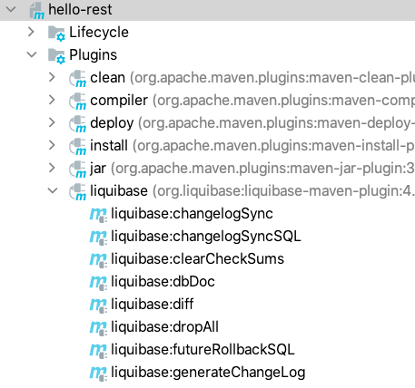
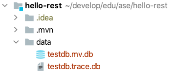
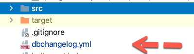

# Liquibase: Do a Database Migration


| [master](master.md)
| [database-bootstrap](database-bootstrap.md)
| [flyway](flyway.md)
| [liquibase](liquibase.md)
| [profiles](profiles.md)
| [docker](docker.md)
| [rest](rest.md)
| [security-step-1](security-step-1.md)
| [security-step-2](security-step-2.md)
|


[Go to liquibase branch](https://github.zhaw.ch/bacn/ase2-spring-boot-hellorest/tree/liquibase)

The **liquibase branch** has been created from the **database-bootstrap** branch and not from the flyway branch.

<br/>

_Liquibase_ is an open-source database schema change management solution which
enables you to manage revisions of your database changes easily.
_Liquibase_ makes it easy for anyone involved in the application release process to:

- Eliminate errors and delays when releasing databases.
- Deploys and Rollback changes for specific versions without needing to know what has already been deployed.
- Deploy database and application changes together so they always stay in sync.


[https://www.liquibase.org/](https://www.liquibase.org/)

<br/>

The tutorial consists of the following steps:

- [Add a dependency to Liquibase](#add-a-dependency-to-liquibase).
- [Add the liquibase configuration to application.properties](#add-a-dependency-to-liquibase).
- [Create a db.changelog-master.yaml file in the folder db/changelog](#create-a-dbchangelog-masteryaml-file-in-the-folder-dbchangelog).
- [Create a master.yaml file in the folder db/changelog-option2](#create-a-masteryaml-file-in-the-folder-dbchangelog-option2).
- [Create a db.changelog_1.yaml file in the folder db/changelog-option2/include](#create-a-dbchangelog_1yaml-file-in-the-folder-dbchangelog-option2include).
- [Create a db.changelog_2.yaml file in the folder db/changelog-option2/include](#create-a-dbchangelog_2yaml-file-in-the-folder-dbchangelog-option2include).
- [Change the unit test CustomerRestControllerTest](#change-the-unit-test-customerrestcontrollertest).
- [Reverse Engineer the H2 database to a changeset with generateChangeLog](#reverse-engineer-the-h2-database-to-a-changeset-with-generatechangelog)

<br/>


<br/>


##  Project Structure for the Liquibase Migration

Create in the resource folder a directory _db/changelog_ and _db/changelog-option2_.

<br/>


<br/>

### Add a dependency to Liquibase


Add a dependency to your pom file. Make sure, the **flyway dependency** is **not** in the pom file:


```xml
      <dependency>
         <groupId>org.liquibase</groupId>
         <artifactId>liquibase-core</artifactId>
         <version>4.3.1</version>
      </dependency>
```

<br/>

### Add the liquibase configuration to application.properties

Add the new properties _spring.liquibase.change-log_ to the _application.properties_ file:


```
spring.jpa.hibernate.ddl-auto=none
spring.jpa.database-platform=org.hibernate.dialect.H2Dialect
spring.datasource.driverClassName=org.h2.Driver
spring.datasource.url=jdbc:h2:mem:testdb
spring.datasource.username=sa
spring.datasource.password=
spring.h2.console.enabled=true

springdoc.swagger-ui.path=/swagger-ui.html

springdoc.version= @springdoc.version@

# spring.liquibase.change-log=classpath:/db/changelog/db.changelog-master.yaml
spring.liquibase.change-log=classpath:/db/changelog-option2/master.yaml

spring.jpa.open-in-view=false
spring.jpa.properties.hibernate.id.new_generator_mappings=false

```
<br/>

### Create a db.changelog-master.yaml file in the folder db/changelog

The idea is to add all change sets in one file. This is **NOT RECOMMENDED**. In the
next chapter we will find more convenient way to work with change sets.

The change set is describing creating 2 tables_

- customer (change set 1)
- checkout (change set 1)
- insert a record into the customer table (change set 2)


```yaml
databaseChangeLog:
  - changeSet:
      id: 1
      author: matthiasbachmann
      changes:
        - createTable:
            tableName: customer
            columns:
              - column:
                  name: id
                  type: bigint
                  autoIncrement: true
                  constraints:
                    primaryKey: true
                    nullable: false
              - column:
                  name: firstname
                  type: varchar(255)
                  constraints:
                    nullable: false
              - column:
                  name: lastname
                  type: varchar(255)
                  constraints:
                    nullable: false
        - createTable:
            tableName: checkout
            columns:
              - column:
                  name: id
                  type: bigint
                  autoIncrement: true
                  constraints:
                    primaryKey: true
                    nullable: false
              - column:
                  name: customer_id
                  type: bigint
  - changeSet:
      id: 2
      author: matthiasbachmann
      changes:
        - insert:
            tableName: customer
            columns:
              - column:
                  name: firstname
                  value: Max
              - column:
                  name: lastname
                  value: Mustermann


```

<br/>

### Create a master.yaml file in the folder db/changelog-option2

This example show how to create a _master.yaml_ file with includes all
change set files from the _include_ folder:


```yaml
databaseChangeLog:

    - includeAll:
        path: include
        relativeToChangelogFile: true
```

<br/>

### Create a db.changelog_1.yaml file in the folder db/changelog-option2/include

This file describes the first set of changes. One file can still contain several change sets.


```yaml
databaseChangeLog:
  - changeSet:
      id: 1
      author: matthiasbachmann
      changes:
        - createTable:
            tableName: customer
            columns:
              - column:
                  name: id
                  type: bigint
                  autoIncrement: true
                  constraints:
                    primaryKey: true
                    nullable: false
              - column:
                  name: firstname
                  type: varchar(255)
                  constraints:
                    nullable: false
              - column:
                  name: lastname
                  type: varchar(255)
                  constraints:
                    nullable: false
        - createTable:
            tableName: checkout
            columns:
              - column:
                  name: id
                  type: bigint
                  autoIncrement: true
                  constraints:
                    primaryKey: true
                    nullable: false
              - column:
                  name: customer_id
                  type: bigint
  - changeSet:
      id: 2
      author: matthiasbachmann
      changes:
        - insert:
            tableName: customer
            columns:
              - column:
                  name: firstname
                  value: Max
              - column:
                  name: lastname
                  value: Mustermann


```

<br/>

### Create a db.changelog_2.yaml file in the folder db/changelog-option2/include

This file describes the second set of changes.

```yaml
databaseChangeLog:
  - changeSet:
      id: 3
      author: matthiasbachmann
      changes:
        - insert:
            tableName: customer
            columns:
              - column:
                  name: firstname
                  value: John
              - column:
                  name: lastname
                  value: Doe

  - changeSet:
      id: 4
      author: matthiasbachmann
      changes:
        - insert:
            tableName: checkout
            columns:
              - column:
                  name: customer_id
                  value: 1

  - changeSet:
      id: 5
      author: matthiasbachmann
      changes:
        - insert:
            tableName: checkout
            columns:
              - column:
                  name: customer_id
                  value: 2

```

<br/>


###  Change the unit test CustomerRestControllerTest

The CustomerRestControllerTest is adapted to the new data. The basic structure is still the same.

<br/>

```java
import static org.junit.jupiter.api.Assertions.assertTrue;
import static org.junit.jupiter.api.Assertions.assertEquals;

import com.example.hellorest.model.Customer;
import com.example.hellorest.repository.CustomerRepository;
import org.junit.jupiter.api.BeforeEach;
import org.junit.jupiter.api.Test;
import org.springframework.beans.factory.annotation.Autowired;
import org.springframework.http.MediaType;
import org.springframework.test.web.servlet.MvcResult;
import org.springframework.test.web.servlet.request.MockMvcRequestBuilders;

public class CustomerRestControllerTest extends AbstractTest {

    @Autowired
    CustomerRepository customerRepository;

    Customer customer1;
    Customer customer2;

    @Override
    @BeforeEach
    public void setUp() {
        super.setUp();
        customer1= new Customer();
        customer1.setFirstname("Felix");
        customer1.setLastname("Mustermann");
        customerRepository.save(customer1);
        customer2= new Customer();
        customer2.setFirstname("Max");
        customer2.setLastname("Mustermann");
        customerRepository.save(customer2);
    }

    @Test
    public void getCustomersList() throws Exception {
        String uri = "/customers";
        MvcResult mvcResult = mvc.perform(MockMvcRequestBuilders.get(uri)
                .accept(MediaType.APPLICATION_JSON_VALUE, "application/hal+json")).andReturn();

        int status = mvcResult.getResponse().getStatus();
        assertEquals(200, status);
        String response = mvcResult.getResponse().getContentAsString();

        String content = extractEmbeddedFromHalJson(response,"customers");
        Customer[] customerList = super.mapFromJson(content, Customer[].class);
        assertTrue(customerList.length > 0);
        assertEquals(customerList[0].getFirstname(), "Max");
        assertEquals(customerList[1].getFirstname(), "John");

    }

    @Test
    public void getOneCustomer() throws Exception {
        String uri = "/customers/1";
        MvcResult mvcResult = mvc.perform(MockMvcRequestBuilders.get(uri)
                .accept(MediaType.APPLICATION_JSON_VALUE, "application/hal+json")).andReturn();

        int status = mvcResult.getResponse().getStatus();
        assertEquals(200, status);
        String response = mvcResult.getResponse().getContentAsString();
        Customer customer = super.mapFromJson(response, Customer.class);
        assertEquals(customer.getFirstname(), "Max");
    }

    @Test
    public void postOneCustomer() throws Exception {
        String uri = "/customers";

        Customer customer= new Customer();
        customer.setFirstname("John");
        customer.setLastname("Doe");

        String json = super.mapToJson(customer);

        MvcResult postMvcResult = mvc.perform(MockMvcRequestBuilders.post(uri)
                .accept(MediaType.APPLICATION_JSON_VALUE, "application/hal+json")
                .content(json))
                .andReturn();

        int status = postMvcResult.getResponse().getStatus();
        assertEquals(201, status);
        String response = postMvcResult.getResponse().getContentAsString();
        Customer postCustomer = super.mapFromJson(response, Customer.class);
        assertEquals(postCustomer.getFirstname(), customer.getFirstname());
    }

}
```

<br/>

###  Check the h2 console

The _h2-console_ shows the new _liquibase_ tables _DATABASECHANGELOG_ and _DATABASECHANGELOGLOCK_.

The customer table.


<br/>

The checkout table


<br/>

## Reverse Engineer the H2 database to a changeset with generateChangeLog

_Liquibase_ can create automatically a change set from an existing database. The configuration
of liquibase including the url of the database can be done with a _liquibase.properties_ file.

The _liquibase.properties_ file is placed in the folder _/src/main/resources/db_.


```yaml
# liquibase.properties

# The output changeLogFile can be xml, yml or json
outputChangeLogFile: dbchangelog.yml
driver: org.h2.Driver
url: jdbc:h2:file:./data/testdb
username: sa
password:
promptOnNonLocalDatabase: false

# diff used for generateChangeLog and diff
diffTypes: tables, views, columns, indexes, foreignkeys, primarykeys, uniqueconstraints, data


# ChangeLog configuration
databaseChangeLogTableName: DATABASECHANGELOG
databaseChangeLogLockTableName: DATABASECHANGELOGLOCK

```

<br/>

_Liquibase_ shall be executed by a maven plugin. Add the following _plugin_ description to your _pom.xml_ file:


```xml
<build>
    <plugins> 
       ...
    
        <plugin>
            <groupId>org.liquibase</groupId>
            <artifactId>liquibase-maven-plugin</artifactId>
            <version>4.2.2</version>
            <configuration>
               <propertyFileWillOverride>true</propertyFileWillOverride>
               <propertyFile>src/main/resources/db/liquibase.properties</propertyFile>
            </configuration>
         </plugin>
         
       ...
    </plugins>      
</build>    
```
<br/>

The _plugin_ is visible in the _Maven_ dialog:



<br/>

_Liquibase_ can only work with _h2-databases_ if the database is saved to a file. For this reason we must change
the property _spring.datasource.url_ in the _application.properties_ file.

Uncomment the _url_ property _spring.datasource.url=jdbc:h2:file:./data/testdb_ and comment the _mem url_ property.

```
spring.datasource.url=jdbc:h2:file:./data/testdb
# spring.datasource.url=jdbc:h2:mem:testdb
```

### You can use the following procedure to create the _changeset_
1. Start the _spring-boot_ application.
2. The _h2-database_ file _testdb.mv.db_ will be created in the folder _data_.
3. **Stop** the _spring boot_ application.
4. Start the _liquibase:generateChangeLog_.
   1. In the _Maven_ dialog click on  _liquibase:generateChangeLog_.
   2. or run in the terminal _mvn liquibase:generateChangeLog_.
5. Copy the generated file in the project root to the correct folder in _src/main/resources/db_.

<br/>



The created database file _testdb.mv.db_.

<br/>

The generated _changelog_ file (you can change the extension to _xml_ or _json_ in the _liquibase.properties_ file):



<br/>

```
databaseChangeLog:
- changeSet:
    id: 1616277557574-1
    author: mbach (generated)
    changes:
    - createTable:
        columns:
        - column:
            autoIncrement: true
            constraints:
              nullable: false
              primaryKey: true
              primaryKeyName: PK_CHECKOUT
            name: ID
            type: BIGINT
        - column:
            name: CUSTOMER_ID
            type: BIGINT
        tableName: CHECKOUT
- changeSet:
    id: 1616277557574-2
    author: mbach (generated)
    changes:
    - createTable:
        columns:
        - column:
            autoIncrement: true
            constraints:
              nullable: false
              primaryKey: true
              primaryKeyName: PK_CUSTOMER
            name: ID
            type: BIGINT
        - column:
            constraints:
              nullable: false
            name: FIRSTNAME
            type: VARCHAR(255)
        - column:
            constraints:
              nullable: false
            name: LASTNAME
            type: VARCHAR(255)
        tableName: CUSTOMER
- changeSet:
    id: 1616277557574-3
    author: mbach (generated)
    changes:
    - insert:
        columns:
        - column:
            name: ID
            valueNumeric: 1
        - column:
            name: CUSTOMER_ID
            valueNumeric: 1
        tableName: CHECKOUT
    - insert:
        columns:
        - column:
            name: ID
            valueNumeric: 2
        - column:
            name: CUSTOMER_ID
            valueNumeric: 2
        tableName: CHECKOUT
- changeSet:
    id: 1616277557574-4
    author: mbach (generated)
    changes:
    - insert:
        columns:
        - column:
            name: ID
            valueNumeric: 1
        - column:
            name: FIRSTNAME
            value: Max
        - column:
            name: LASTNAME
            value: Mustermann
        tableName: CUSTOMER
    - insert:
        columns:
        - column:
            name: ID
            valueNumeric: 2
        - column:
            name: FIRSTNAME
            value: John
        - column:
            name: LASTNAME
            value: Doe
        tableName: CUSTOMER
    - insert:
        columns:
        - column:
            name: ID
            valueNumeric: 3
        - column:
            name: FIRSTNAME
            value: Felix
        - column:
            name: LASTNAME
            value: Muster
        tableName: CUSTOMER

databaseChangeLog:
- changeSet:
    id: 1616278832279-1
    author: mbach (generated)
    changes:
    - createTable:
        columns:
        - column:
            autoIncrement: true
            constraints:
              nullable: false
              primaryKey: true
              primaryKeyName: PK_CHECKOUT
            name: ID
            type: BIGINT
        - column:
            name: CUSTOMER_ID
            type: BIGINT
        tableName: CHECKOUT
- changeSet:
    id: 1616278832279-2
    author: mbach (generated)
    changes:
    - createTable:
        columns:
        - column:
            autoIncrement: true
            constraints:
              nullable: false
              primaryKey: true
              primaryKeyName: PK_CUSTOMER
            name: ID
            type: BIGINT
        - column:
            constraints:
              nullable: false
            name: FIRSTNAME
            type: VARCHAR(255)
        - column:
            constraints:
              nullable: false
            name: LASTNAME
            type: VARCHAR(255)
        tableName: CUSTOMER
- changeSet:
    id: 1616278832279-3
    author: mbach (generated)
    changes:
    - insert:
        columns:
        - column:
            name: ID
            valueNumeric: 1
        - column:
            name: CUSTOMER_ID
            valueNumeric: 1
        tableName: CHECKOUT
    - insert:
        columns:
        - column:
            name: ID
            valueNumeric: 2
        - column:
            name: CUSTOMER_ID
            valueNumeric: 2
        tableName: CHECKOUT
- changeSet:
    id: 1616278832279-4
    author: mbach (generated)
    changes:
    - insert:
        columns:
        - column:
            name: ID
            valueNumeric: 1
        - column:
            name: FIRSTNAME
            value: Max
        - column:
            name: LASTNAME
            value: Mustermann
        tableName: CUSTOMER
    - insert:
        columns:
        - column:
            name: ID
            valueNumeric: 2
        - column:
            name: FIRSTNAME
            value: John
        - column:
            name: LASTNAME
            value: Doe
        tableName: CUSTOMER
    - insert:
        columns:
        - column:
            name: ID
            valueNumeric: 3
        - column:
            name: FIRSTNAME
            value: Felix
        - column:
            name: LASTNAME
            value: Muster
        tableName: CUSTOMER


```


The console _log-output_ for generating the _liquibase changelog_:

```
[INFO] Scanning for projects...
[INFO] 
[INFO] -----------------------< com.example:hello-rest >-----------------------
[INFO] Building hello-rest 0.0.1-SNAPSHOT
[INFO] --------------------------------[ jar ]---------------------------------
[INFO] 
[INFO] --- liquibase-maven-plugin:4.2.2:generateChangeLog (default-cli) @ hello-rest ---
[INFO] ------------------------------------------------------------------------
[project, pluginDescriptor]
[INFO] Parsing Liquibase Properties File
[INFO]   File: src/main/resources/db/liquibase.properties
[INFO] ------------------------------------------------------------------------
[INFO] 
[INFO] 
[INFO] Liquibase Community 4.2.2 by Datical
[INFO] ####################################################
##   _     _             _ _                      ##
##  | |   (_)           (_) |                     ##
##  | |    _  __ _ _   _ _| |__   __ _ ___  ___   ##
##  | |   | |/ _` | | | | | '_ \ / _` / __|/ _ \  ##
##  | |___| | (_| | |_| | | |_) | (_| \__ \  __/  ##
##  \_____/_|\__, |\__,_|_|_.__/ \__,_|___/\___|  ##
##              | |                               ##
##              |_|                               ##
##                                                ## 
##  Get documentation at docs.liquibase.com       ##
##  Get certified courses at learn.liquibase.com  ## 
##  Free schema change activity reports at        ##
##      https://hub.liquibase.com                 ##
##                                                ##
####################################################
Starte Liquibase am 23:20:31 (Version 4.2.2 #36, kompiliert am 2020-12-09 20:07+0000)
[INFO] Parsing Liquibase Properties File src/main/resources/db/liquibase.properties for changeLog parameters
[INFO] Executing on Database: jdbc:h2:file:./data/testdb
[INFO] Generating Change Log from database SA @ jdbc:h2:file:./data/testdb (Default Schema: PUBLIC)
BEST PRACTICE: The changelog generated by diffChangeLog/generateChangeLog should be inspected for correctness and completeness before being deployed.
[INFO] dbchangelog.yml exists, appending
[INFO] Output written to Change Log file, dbchangelog.yml
[INFO] ------------------------------------------------------------------------
[INFO] 
[INFO] ------------------------------------------------------------------------
[INFO] BUILD SUCCESS
[INFO] ------------------------------------------------------------------------
[INFO] Total time:  2.092 s
[INFO] Finished at: 2021-03-20T23:20:32+01:00
[INFO] ------------------------------------------------------------------------
```
