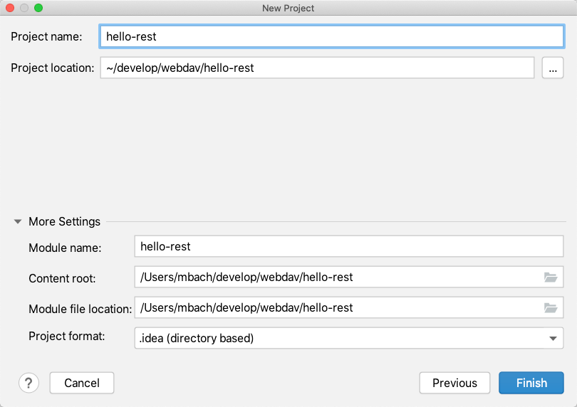

# Master: Create the Initial Project Setup

[Go to master branch](https://github.zhaw.ch/bacn/ase2-spring-boot-hellorest/tree/master)

## Hands-on 0: Use Spring Initializer in IntelliJ (Ultimate Edition)

Choose Java SDK (can 8, 11, 14, etc)

<br/>


<br/>

Choose group and artifact id, build automation, language and packaging, project name, description and package

<br/>


<br/>

Choose the dependencies like Spring Web and SQL H2 Data Base:

<br/>


<br/>


<br/>

Choose project name and folder:

<br/>



<br/>

The following artifacts were created:
<br/>


<br/>

The spring-boot plugin allows to start the project.

<br/>


<br/>


## Hands-on 1: First test after initial project setup

###  HelloWorldApplication Klasse

<br/>

```java
import static org.hamcrest.Matchers.equalTo;
import static org.springframework.test.web.servlet.result.MockMvcResultMatchers.content;
import static org.springframework.test.web.servlet.result.MockMvcResultMatchers.status;
import org.springframework.boot.SpringApplication;
import org.springframework.boot.autoconfigure.SpringBootApplication;
import org.springframework.stereotype.Controller;
import org.springframework.web.bind.annotation.RequestMapping;
import org.springframework.web.bind.annotation.ResponseBody;

@SpringBootApplication
@Controller
public class HelloWorldApplication {

    public static void main(String[] args) {
        SpringApplication.run(HelloWorldApplication.class, args);
    }

    @RequestMapping("/")
    @ResponseBody
    String home() {
        return "Hello World";
    }


}

```
Run the application:

<br/>


<br>


### HelloControllerTest Klasse

<br/>

```java
import static org.hamcrest.Matchers.equalTo;
import static org.springframework.test.web.servlet.result.MockMvcResultMatchers.content;
import static org.springframework.test.web.servlet.result.MockMvcResultMatchers.status;

import org.junit.jupiter.api.Test;
import org.springframework.beans.factory.annotation.Autowired;
import org.springframework.boot.test.autoconfigure.web.servlet.AutoConfigureMockMvc;
import org.springframework.boot.test.context.SpringBootTest;
import org.springframework.http.MediaType;
import org.springframework.test.web.servlet.MockMvc;
import org.springframework.test.web.servlet.request.MockMvcRequestBuilders;

@SpringBootTest
@AutoConfigureMockMvc
public class HelloControllerTest {

    @Autowired
    private MockMvc mvc;

    @Test
    public void getHello() throws Exception {
        mvc.perform(MockMvcRequestBuilders.get("/").accept(MediaType.APPLICATION_JSON))
                .andExpect(status().isOk())
                .andExpect(content().string(equalTo("Hello World")));
    }
}
```
<br/>

Run the unit test:

<br/>


<br/>


## Hands-on 2: Create Models and Repositories

### Project Structure

Create the project structure with a package for model and repository classes.

<br/>


<br/>

### Pom with dependencies for Open Api

<br/>

```xml
<dependency>
  <groupId>org.springdoc</groupId>
  <artifactId>springdoc-openapi-ui</artifactId>
  <version>1.5.5</version>
</dependency>

<!-- Open API for Automatic Rest Interfaces -->
<dependency>
  <groupId>org.springdoc</groupId>
  <artifactId>springdoc-openapi-data-rest</artifactId>
  <version>1.5.5</version>
</dependency>
```

<br/>

### Application Start

<br/>

```java
import io.swagger.v3.oas.models.Components;
import io.swagger.v3.oas.models.OpenAPI;
import io.swagger.v3.oas.models.info.Info;
import io.swagger.v3.oas.models.info.License;
import org.springframework.beans.factory.annotation.Value;
import org.springframework.boot.SpringApplication;
import org.springframework.boot.autoconfigure.SpringBootApplication;
import org.springframework.context.annotation.Bean;

import javax.annotation.PostConstruct;

@SpringBootApplication
public class HelloRestApplication {

    public static void main(String[] args) {
        SpringApplication.run(HelloRestApplication.class, args);
    }

    @PostConstruct
    public void afterInit() {
        System.out.println("\n\nEnter in Browser:\nhttp://localhost:8080 \n" +
                "http://localhost:8080/v3/api-docs\n" +
                "http://localhost:8080/v3/api-docs.yaml -> yaml file is downloaded -> https://editor.swagger.io/\n" +
                "http://localhost:8080/swagger-ui.html \n" +
                "http://localhost:8080/h2-console  " + "" +
                "-> mit Generic H2 (Embedded), org.h2.Driver, jdbc:h2:mem:testdb und sa \n\n");
    }
    @Bean
    public OpenAPI customOpenAPI(@Value("${springdoc.version}") String appVersion) {
        return new OpenAPI()
                .components(new Components())
                .info(new Info().title("Customer and Checkout API for ASE").version(appVersion)
                        .license(new License().name("Apache 2.0").url("http://springdoc.org")));
    }
}

```

<br/>

### Application Properties (in Resources)

<br/>

```
spring.jpa.hibernate.ddl-auto=create-drop
spring.jpa.database-platform=org.hibernate.dialect.H2Dialect
spring.datasource.driverClassName=org.h2.Driver
spring.datasource.url=jdbc:h2:mem:testdb
spring.datasource.username=sa
spring.datasource.password=
spring.h2.console.enabled=true

springdoc.swagger-ui.path=/swagger-ui.html

springdoc.version= @springdoc.version@
```
<br/>

### Model Klasse Customer

<br/>

```java
import javax.persistence.Entity;
import javax.persistence.GeneratedValue;
import javax.persistence.Id;

/**
 * Model class for customer
 */
@Entity
public class Customer {

    @Id 
    @GeneratedValue(strategy = GenerationType.IDENTITY)
    private Long id;

    private String firstname;
    private String lastname;

    public String getFirstname() {
        return firstname;
    }

    public void setFirstname(String firstname) {
        this.firstname = firstname;
    }

    public String getLastname() {
        return lastname;
    }

    public void setLastname(String lastname) {
        this.lastname = lastname;
    }
}
```
<br/>

### Model Klasse Checkout

<br/>

```java
import javax.persistence.Entity;
import javax.persistence.GeneratedValue;
import javax.persistence.Id;
import javax.persistence.OneToOne;

/**
 * Model class for checkout
 */
@Entity
public class Checkout {

    @Id
    @GeneratedValue(strategy = GenerationType.IDENTITY)
    private Long id;

    @OneToOne
    private Customer customer;

    public Customer getCustomer() {
        return customer;
    }

    public void setCustomer(Customer customer) {
        this.customer = customer;
    }
}
```

<br/>

### Repositories

### CustomerRepository

<br/>

```java
/**
 * Repository class for Customer
 */
//@RepositoryRestResource(exported = false)
@RepositoryRestResource(path = "customers")
public interface CustomerRepository extends CrudRepository<Customer, Long> {
}
```

<br/>

### CheckoutRepository

<br/>

```java
/**
 * Repository class for Checkout
 */

public interface CheckoutRepository extends CrudRepository<Checkout, Long> {
}
```

<br/>

### AbstractTest

<br/>

```java

import com.fasterxml.jackson.core.type.TypeReference;
import com.fasterxml.jackson.databind.DeserializationFeature;
import org.springframework.beans.factory.annotation.Autowired;
import org.springframework.boot.test.autoconfigure.web.servlet.AutoConfigureMockMvc;
import org.springframework.boot.test.context.SpringBootTest;

import org.springframework.test.web.servlet.MockMvc;
import org.springframework.test.web.servlet.setup.MockMvcBuilders;
import org.springframework.web.context.WebApplicationContext;

import com.fasterxml.jackson.core.JsonParseException;
import com.fasterxml.jackson.core.JsonProcessingException;
import com.fasterxml.jackson.databind.JsonMappingException;
import com.fasterxml.jackson.databind.ObjectMapper;

import java.io.IOException;
import java.util.HashMap;
import java.util.List;
import java.util.Map;

@SpringBootTest
@AutoConfigureMockMvc
public abstract class AbstractTest {
    protected MockMvc mvc;
    @Autowired
    WebApplicationContext webApplicationContext;

    protected void setUp() {
        mvc = MockMvcBuilders.webAppContextSetup(webApplicationContext).build();
    }


    protected String mapToJson(Object obj) throws JsonProcessingException {
        ObjectMapper objectMapper = new ObjectMapper();
        return objectMapper.writeValueAsString(obj);
    }
    protected <T> T mapFromJson(String json, Class<T> clazz)
            throws JsonParseException, JsonMappingException, IOException {

        ObjectMapper objectMapper = new ObjectMapper();
        objectMapper.configure(DeserializationFeature.FAIL_ON_UNKNOWN_PROPERTIES, false);
        return objectMapper.readValue(json, clazz);
    }

    protected String extractEmbeddedFromHalJson(String content, String attribute) {
        final ObjectMapper mapper = new ObjectMapper();
        try {
            Map<String,Object> map = new HashMap<>();
            map = mapper.readValue(content, new TypeReference<HashMap<String,Object>>(){});
            Map<String,Object> embedded = (Map<String, Object>) map.get("_embedded");
            List<Object> customers = (List<Object>) embedded.get(attribute);
            return mapToJson(customers);
        } catch (IOException e) {
            e.printStackTrace();
        }
        return null;
    }


}
```

<br/>

### CustomerRestControllerTest

<br/>

```java
import static org.junit.jupiter.api.Assertions.assertTrue;
import static org.junit.jupiter.api.Assertions.assertEquals;

import com.example.hellorest.model.Customer;
import com.example.hellorest.repository.CustomerRepository;
import org.junit.jupiter.api.BeforeEach;
import org.junit.jupiter.api.Test;
import org.springframework.beans.factory.annotation.Autowired;
import org.springframework.http.MediaType;
import org.springframework.test.web.servlet.MvcResult;
import org.springframework.test.web.servlet.request.MockMvcRequestBuilders;

public class CustomerRestControllerTest extends AbstractTest {

    @Autowired
    CustomerRepository customerRepository;

    Customer customer1;
    Customer customer2;

    @Override
    @BeforeEach
    public void setUp() {
        super.setUp();
        customer1= new Customer();
        customer1.setFirstname("Felix");
        customer1.setLastname("Muster");
        customerRepository.save(customer1);
        customer2= new Customer();
        customer2.setFirstname("Max");
        customer2.setLastname("Mustermann");
        customerRepository.save(customer2);
    }

    @Test
    public void getCustomersList() throws Exception {
        String uri = "/customers";
        MvcResult mvcResult = mvc.perform(MockMvcRequestBuilders.get(uri)
                .accept(MediaType.APPLICATION_JSON_VALUE, "application/hal+json")).andReturn();

        int status = mvcResult.getResponse().getStatus();
        assertEquals(200, status);
        String response = mvcResult.getResponse().getContentAsString();

        String content = extractEmbeddedFromHalJson(response,"customers");
        Customer[] customerList = super.mapFromJson(content, Customer[].class);
        assertTrue(customerList.length > 0);
        assertEquals(customerList[0].getFirstname(), customer1.getFirstname());
        assertEquals(customerList[1].getFirstname(), customer2.getFirstname());

    }

    @Test
    public void getOneCustomer() throws Exception {
        String uri = "/customers/1";
        MvcResult mvcResult = mvc.perform(MockMvcRequestBuilders.get(uri)
                .accept(MediaType.APPLICATION_JSON_VALUE, "application/hal+json")).andReturn();

        int status = mvcResult.getResponse().getStatus();
        assertEquals(200, status);
        String response = mvcResult.getResponse().getContentAsString();
        Customer customer = super.mapFromJson(response, Customer.class);
        assertEquals(customer.getFirstname(), customer1.getFirstname());
    }

    @Test
    public void postOneCustomer() throws Exception {
        String uri = "/customers";

        Customer customer= new Customer();
        customer.setFirstname("John");
        customer.setLastname("Doe");

        String json = super.mapToJson(customer);

        MvcResult postMvcResult = mvc.perform(MockMvcRequestBuilders.post(uri)
                .accept(MediaType.APPLICATION_JSON_VALUE, "application/hal+json")
                .content(json))
                .andReturn();

        int status = postMvcResult.getResponse().getStatus();
        assertEquals(201, status);
        String response = postMvcResult.getResponse().getContentAsString();
        Customer postCustomer = super.mapFromJson(response, Customer.class);
        assertEquals(postCustomer.getFirstname(), customer.getFirstname());
    }

}
```
<br/>

## Test H2 Database

<br/>

Enter in Browser: http://localhost:8080/h2-console

<br/>


<br/>

After connection to the console you can see all generated tables.

<br/>


<br/>

## Working with Postman


You can download postman from [https://www.postman.com/downloads/](https://www.postman.com/downloads/)

<br/>

Create a get request:

<br/>


<br/>

Create a post request:

<br/>


<br/>
