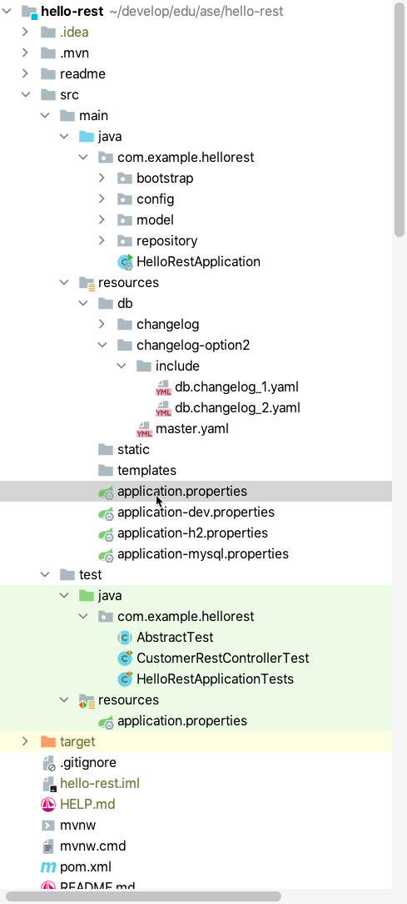

# Profiles: Define different database setups (h2 or mysql)


| [master](master.md)
| [database-bootstrap](database-bootstrap.md)
| [flyway](flyway.md)
| [liquibase](liquibase.md)
| [profiles]()
| [docker](docker.md)
| [rest](rest.md)
| [security-step-1](security-step-1.md)
| [security-step-2](security-step-2.md)
|


[Go to profiles branch](https://github.zhaw.ch/bacn/ase2-spring-boot-hellorest/tree/profiles)

The **profiles branch** has been created from the **liquibase** branch and not from the flyway branch.

[https://docs.spring.io/spring-boot/docs/1.2.0.M1/reference/html/boot-features-profiles.html](https://docs.spring.io/spring-boot/docs/1.2.0.M1/reference/html/boot-features-profiles.html)

## Goal in this tutorial

We want to create several profiles in order to support several use cases for the HelloRest application:

- Supporting a dev (development) profile which gives us an OpenApi frontend
- Optional databases H2 or MySQL
- Adding environment variables with defaults to the configuration (for later use with docker)

<br/>


## To do in this step

- [Add a dependency for MySQL](#add-a-dependency-for-mysql)
- [Change the application.properties](#change-the-applicationproperties)
- [Create an application-dev.properties](#create-an-application-devproperties)
- [Create an application-h2.properties](#create-an-application-h2properties)
- [Create an application-mysql.properties](#create-an-application-mysqlproperties)
- [Create an application.properties in the test resources](#create-an-applicationproperties-in-the-test-resources)
- [Change the DevConfiguration class](#change-the-devconfiguration-class)
- [Improve the HelloRestApplication class](#improve-the-hellorestapplication-class)

<br/>

##  Project Structure for Supporting different Profiles

Create the test/resource folder:

<br/>



<br/>

### Add a dependency for MySQL

<br/>

Add a dependency for the mysql database to your pom file:

<br/>

```xml
      <dependency>
         <groupId>mysql</groupId>
         <artifactId>mysql-connector-java</artifactId>
         <version>8.0.23</version>
      </dependency>
```

<br/>


### Change the application.properties

The _application.properties_ file contains the generic properties. Through the property
_spring.profiles.active=${ACTIVE_PROFILES:dev,h2}_ we can choose which profiles we
want to add.

<br/>

```
spring.profiles.active=${ACTIVE_PROFILES:dev,h2}

spring.application.name=${APP_NAME:Hello Rest}

# spring.liquibase.change-log=classpath:/db/changelog/db.changelog-master.yaml
spring.liquibase.change-log=classpath:/db/changelog-option2/master.yaml

springdoc.api-docs.enabled=false
```

<br/>

### Create an application-dev.properties

The _application-dev.properties_ consists of the properties for the configuration of the _Spring OpenApi_.

<br/>

```
springdoc.swagger-ui.path=/swagger-ui.html

springdoc.version= @springdoc.version@

springdoc.api-docs.enabled=true
```
<br/>

### Create an application-h2.properties

The _application-h2.properties_ are configuring the H2 database including the _h2-console_.

<br/>

```
spring.jpa.hibernate.ddl-auto=none
spring.jpa.database-platform=org.hibernate.dialect.H2Dialect
spring.jpa.open-in-view=false
spring.jpa.properties.hibernate.id.new_generator_mappings=false

spring.datasource.driverClassName=org.h2.Driver
spring.datasource.url=jdbc:h2:mem:testdb
# spring.datasource.url=jdbc:h2:file:./data/testdb
spring.datasource.username=sa
spring.datasource.password=

spring.h2.console.enabled=true
spring.h2.console.settings.web-allow-others=true
```

<br/>

### Create an application-mysql.properties

The _application-mysql.properties_ are configuring the MySql database. The url
contains options to:

- create the database if it is not existing
- allow the public key retrieval (mandatory for MySQL8.x)
- UTF-8 character encoding

<br/>

```
spring.jpa.hibernate.ddl-auto=none
spring.jpa.database-platform=org.hibernate.dialect.MySQL5InnoDBDialect
spring.jpa.open-in-view=false
spring.jpa.properties.hibernate.id.new_generator_mappings=false


spring.datasource.driverClassName=com.mysql.cj.jdbc.Driver
spring.datasource.url=jdbc:mysql://${APP_DB_HOST:localhost}:${APP_DB_PORT:3306}/${APP_DB_NAME:hellorest}?useUnicode=true&characterEncoding=utf8&useSSL=false&allowPublicKeyRetrieval=true&serverTimezone=UTC&useLegacyDatetimeCode=false&createDatabaseIfNotExist=true
spring.datasource.username= ${APP_DB_USERNAME:root}
spring.datasource.password=${APP_DB_PASSWORD:password}

```

<br/>

### Create an application.properties in the test resources

In order always use the _H2 Database_ for testing we want to create an extra a_pplication.properties_ in the _test resources_.

```
spring.profiles.active=${ACTIVE_PROFILES:dev,h2}

spring.application.name=${APP_NAME:Hello Rest}

# spring.liquibase.change-log=classpath:/db/changelog/db.changelog-master.yaml
spring.liquibase.change-log=classpath:/db/changelog-option2/master.yaml

springdoc.api-docs.enabled=false
```

### Change the DevConfiguration class

Make the DatabaseBootstrap dependent on the dev-profile and the h2 database.

<br/>

```java
import com.example.hellorest.bootstrap.DatabaseBootstrap;
import org.springframework.boot.autoconfigure.condition.ConditionalOnClass;
import org.springframework.context.annotation.Bean;
import org.springframework.context.annotation.Configuration;
import org.springframework.context.annotation.Profile;


/**
 * Defines a Bean for the DatabaseBootstrap
 */
@Configuration
@Profile("dev")
@ConditionalOnClass(name = {"org.h2.Driver"})
public class DevConfiguration {

    @Bean
    public DatabaseBootstrap databaseBootstrap() {
        return new DatabaseBootstrap();
    }

}

```

<br/>

### Improve the HelloRestApplication class

Make the HelloRestApplication class console links dependant on the dev and h2 profile

<br/>


```java
import io.swagger.v3.oas.models.Components;
import io.swagger.v3.oas.models.OpenAPI;
import io.swagger.v3.oas.models.info.Info;
import io.swagger.v3.oas.models.info.License;
import org.springframework.beans.factory.annotation.Autowired;
import org.springframework.beans.factory.annotation.Value;
import org.springframework.boot.SpringApplication;
import org.springframework.boot.autoconfigure.SpringBootApplication;
import org.springframework.context.annotation.Bean;
import org.springframework.context.annotation.Profile;
import org.springframework.core.env.Environment;

import javax.annotation.PostConstruct;
import java.util.Arrays;

@SpringBootApplication
public class HelloRestApplication {

    @Autowired
    private Environment env;

    public static void main(String[] args) {
        SpringApplication.run(HelloRestApplication.class, args);
    }

    @PostConstruct
    public void afterInit() {
        boolean hasDevProfile = Arrays.asList(env.getActiveProfiles()).contains("dev");
        boolean hasH2Database = Arrays.asList(env.getActiveProfiles()).contains("h2");
        String applicationName = env.getProperty("spring.application.name");
        String openApiInfo="";
        String h2ConsoleInfo="";
        if (hasDevProfile) {
            openApiInfo = "http://localhost:8080/v3/api-docs\n" +
                    "http://localhost:8080/v3/api-docs.yaml -> yaml file is downloaded -> https://editor.swagger.io/\n" +
                    "http://localhost:8080/swagger-ui.html \n";
        }
        if (hasH2Database) {
            h2ConsoleInfo= "http://localhost:8080/h2-console  " + "" +
                    "-> mit Generic H2 (Embedded), org.h2.Driver, jdbc:h2:mem:testdb und sa \n";
        }
        System.out.println("\n\nApplication [" + applicationName + "] - Enter in Browser:\nhttp://localhost:8080 \n" +
                openApiInfo +
                h2ConsoleInfo + "\n" +
                "Active Profiles: " + Arrays.toString(env.getActiveProfiles()) + "\n\n");
    }

    @Bean
    @Profile("dev")
    public OpenAPI customOpenAPI(@Value("${springdoc.version}") String appVersion) {
        return new OpenAPI()
                .components(new Components())
                .info(new Info().title("Customer and Checkout API for ASE").version(appVersion)
                        .license(new License().name("Apache 2.0").url("http://springdoc.org")));
    }
}

```
