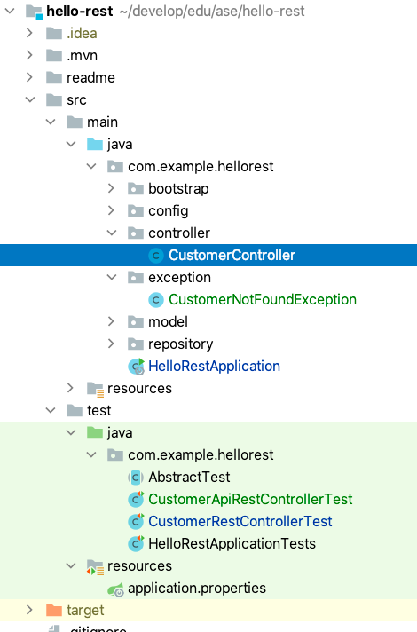

# Rest: Create a Rest Controller

[Go to the Rest branch](https://github.zhaw.ch/bacn/ase2-spring-boot-hellorest/tree/rest)

The **rest branch** has been created from the **docker** branch..

##  Project Structure for a Rest Controller

Create the package controller and exception.

<br/>



<br/>

##  New Rest Api for the Customer Entity

Enter in the browser:

http://localhost:8080/api/customers/

You should get the following result:

```json
[
  {
    firstname: "Max",
    lastname: "Mustermann"
  },
  {
    firstname: "John",
    lastname: "Doe"
  },
  {
    firstname: "Felix",
    lastname: "Muster"
  }
]
```

<br/>

The new controller is visible in the OpenApi view.


<br/>

### Create the CustomerController class

<br/>

```java
import com.example.hellorest.exception.CustomerNotFoundException;
import com.example.hellorest.model.Customer;
import com.example.hellorest.repository.CustomerRepository;
import org.springframework.beans.factory.annotation.Autowired;
import org.springframework.http.HttpStatus;
import org.springframework.web.bind.annotation.*;

import javax.servlet.http.HttpServletResponse;
import java.io.IOException;
import java.util.Optional;

@RestController
@RequestMapping("/api/customers")
public class CustomerController {

	private final CustomerRepository customerRepository;

	@Autowired
	public CustomerController(CustomerRepository customerRepository){
		this.customerRepository = customerRepository;
	}

	@RequestMapping( value = "/", method = RequestMethod.GET )
	public Iterable<Customer> list(){
		return customerRepository.findAll();
	}

	@RequestMapping( value = "/", method = RequestMethod.POST )
	public Customer create(@RequestBody Customer customer){
		return customerRepository.save(customer);
	}

	@RequestMapping( value = "/{id}", method = RequestMethod.GET )
	public Customer read(@PathVariable(value="id") long id) throws CustomerNotFoundException {
		Optional<Customer> customer = customerRepository.findById(id);

		if( customer.isEmpty() ){
			throw new CustomerNotFoundException("Customer with id: " + id + " not found.");
		}
		return customer.get();
	}

	@RequestMapping( value = "/{id}", method = RequestMethod.PUT )
	public Customer update(@PathVariable(value="id") long id, @RequestBody Customer customer){
		return customerRepository.save(customer);
	}

	@RequestMapping( value = "/{id}", method = RequestMethod.DELETE )
	public void delete(@PathVariable(value="id") long id){
		customerRepository.deleteById(id);
	}

	@ExceptionHandler(CustomerNotFoundException.class)
	public void handleCustomerNotFound(CustomerNotFoundException exception, HttpServletResponse response) throws IOException{
		response.sendError( HttpStatus.NOT_FOUND.value(), exception.getMessage() );
	}

}

```
<br/>

### Create the CustomerNotFoundException class

<br/>

```java
public class CustomerNotFoundException extends RuntimeException {

	private static final long serialVersionUID = -1226439803994500725L;

	public CustomerNotFoundException(String msg){
		super(msg);
	}

}

```
<br/>


### Create the CustomerApiRestController class

<br/>

```java
package com.example.hellorest;

import com.example.hellorest.model.Customer;
import com.example.hellorest.repository.CustomerRepository;
import org.junit.jupiter.api.BeforeEach;
import org.junit.jupiter.api.Test;
import org.springframework.beans.factory.annotation.Autowired;
import org.springframework.http.MediaType;
import org.springframework.test.web.servlet.MvcResult;
import org.springframework.test.web.servlet.request.MockMvcRequestBuilders;

import static org.junit.jupiter.api.Assertions.assertEquals;
import static org.junit.jupiter.api.Assertions.assertTrue;

public class CustomerApiRestControllerTest extends AbstractTest {

    @Autowired
    CustomerRepository customerRepository;

    @Override
    @BeforeEach
    public void setUp() {
        super.setUp();
    }

    @Test
    public void getCustomersList() throws Exception {
        String uri = "/api/customers/";
        MvcResult mvcResult = mvc.perform(MockMvcRequestBuilders.get(uri)
                .accept(MediaType.APPLICATION_JSON_VALUE)).andReturn();

        int status = mvcResult.getResponse().getStatus();
        assertEquals(200, status);
        String response = mvcResult.getResponse().getContentAsString();

        Customer[] customerList = super.mapFromJson(response, Customer[].class);
        assertTrue(customerList.length > 0);
        assertEquals(customerList[0].getFirstname(), "Max");
        assertEquals(customerList[1].getFirstname(), "John");

    }

    @Test
    public void getOneCustomer() throws Exception {
        String uri = "/customers/1";
        MvcResult mvcResult = mvc.perform(MockMvcRequestBuilders.get(uri)
                .accept(MediaType.APPLICATION_JSON_VALUE)).andReturn();

        int status = mvcResult.getResponse().getStatus();
        assertEquals(200, status);
        String response = mvcResult.getResponse().getContentAsString();
        Customer customer = super.mapFromJson(response, Customer.class);
        assertEquals(customer.getFirstname(), "Max");
    }

    @Test
    public void postOneCustomer() throws Exception {
        String uri = "/customers";

        Customer customer= new Customer();
        customer.setFirstname("John");
        customer.setLastname("Doe");

        String json = super.mapToJson(customer);

        MvcResult postMvcResult = mvc.perform(MockMvcRequestBuilders.post(uri)
                .accept(MediaType.APPLICATION_JSON_VALUE)
                .content(json))
                .andReturn();

        int status = postMvcResult.getResponse().getStatus();
        assertEquals(201, status);
        String response = postMvcResult.getResponse().getContentAsString();
        Customer postCustomer = super.mapFromJson(response, Customer.class);
        assertEquals(postCustomer.getFirstname(), customer.getFirstname());
    }

}

```
<br/>

### Change the code snippet in the HelloRestApplication class

The code snippet contains the new url to the http://localhost:8080/api/customers/ api.

```java
        System.out.println("\n\nApplication [" + applicationName + "] - Enter in Browser:\nhttp://localhost:8080 or http://localhost:8080/api/customers/ \n" +
                openApiInfo +
                h2ConsoleInfo + "\n" +
                "Active Profiles: " + Arrays.toString(env.getActiveProfiles()) + "\n\n");

```

