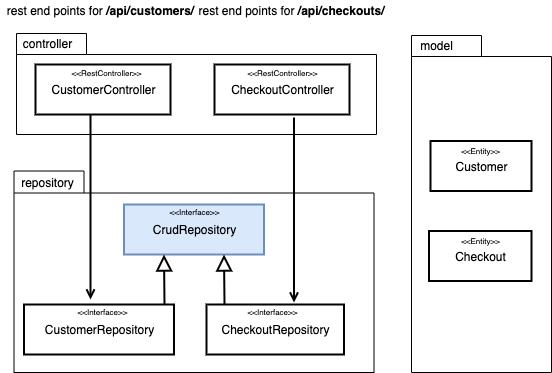

# Rest: Create a Rest Controller


| [master](master.md)
| [database-bootstrap](database-bootstrap.md)
| [flyway](flyway.md)
| [liquibase](liquibase.md)
| [profiles](profiles.md)
| [docker](docker.md)
| [rest]()
| [security-step-1](security-step-1.md)
| [security-step-2]()
|


[Go to the Rest branch](https://github.zhaw.ch/bacn/ase2-spring-boot-hellorest/tree/rest)

The **rest branch** has been created from the **docker** branch.

The goal of this tutorial is creating own controllers for the rest end points.

<br/>



<br/>

The design class diagram show the new controllers with the end points. Each controller is calling directly the repository.
The models are used for the persistence to the database and also as dto. This gives us a coupling which can give
problems in the future if the database, or the rest interface will change. A solution could be using dto's for the rest interface.

<br/>

## To do in this step

- [Add Getter and Setter for the _id_ to the Model Classes](#add-getter-and-setter-for-the-id-to-the-model-classes)
- [Add Cascade to the Checkout Model](#add-cascade-to-the-checkout-model)
- [Create the _CustomerController_ class](#create-the-customercontroller-class)
- [Create the _CustomerNotFoundException_ class](#create-the-customernotfoundexception-class)
- [Create the _CustomerApiRestControllerTest class](#create-the-customerapirestcontrollertest-class)
- [Create the _CheckoutController_ class](#create-the-checkoutcontroller-class)
- [Create the _CheckoutNotFoundException_ class](#create-the-checkoutnotfoundexception-class)
- [Create the _CheckoutApiRestControllerTest_ class](#create-the-checkoutapirestcontrollertest-class)


##  Project Structure for a Rest Controller

Create the package controller and exception.

<br/>


<br/>

##  New Rest Api for the Customer Entity

Enter in the browser:

http://localhost:8080/api/customers/

You should get the following result:

```json
[
  {
    "id": 1,
    "firstname": "Max",
    "lastname": "Mustermann"
  },
  {
    "id": 2,
    "firstname": "John",
    "lastname": "Doe"
  },
  {
    "id": 3,
    "firstname": "Felix",
    "lastname": "Muster"
  }
]
```

<br/>

http://localhost:8080/api/checkouts/


You should get the following result:

```json
[
  {
    id: 1,
    customer: {
      id: 1,
      firstname: "Max",
      lastname: "Mustermann"
    }
  },
  {
    id: 2,
    customer: {
      id: 2,
      firstname: "John",
      lastname: "Doe"
    }
  }
]
```

<br/>


The new controller is visible in the _OpenApi view_.


<br/>

### Add Getter and Setter for the id to the Model Classes

In order to get the id as a result of the REST get request, we need adding the getter and setter.

**Checkout**

<br/>

```java
    public Long getId() {
        return id;
    }

    public void setId(Long id) {
        this.id = id;
    }
```

<br/>

**Customer**

<br/>

```java
    public Long getId() {
        return id;
    }

    public void setId(Long id) {
        this.id = id;
    }
```

<br/>

### Add _Cascade_ to the Checkout Model

The _(cascade=CascadeType.ALL)_ is providing the customer object at the rest get request.

```java
    @OneToOne(cascade=CascadeType.ALL)
    private Customer customer;
```

### Create the CustomerController class

The _CustomerController_ class is providing the following rest end points:

- Get a list of customers /api/customers/
- Get one customer /api/customers/<id>
- Post a new customer /api/customers/
- Put (change) an existing customer /api/customers/<id>
- Delete an existing customer /api/customers/<id>

<br/>

```java
import com.example.hellorest.exception.CustomerNotFoundException;
import com.example.hellorest.model.Customer;
import com.example.hellorest.repository.CustomerRepository;
import org.springframework.beans.factory.annotation.Autowired;
import org.springframework.http.HttpStatus;
import org.springframework.http.MediaType;
import org.springframework.web.bind.annotation.*;

import javax.servlet.http.HttpServletResponse;
import java.io.IOException;
import java.util.Optional;

@RestController
@RequestMapping("/api/customers")
public class CustomerController {

	private final CustomerRepository customerRepository;

	@Autowired
	public CustomerController(CustomerRepository customerRepository){
		this.customerRepository = customerRepository;
	}

	@RequestMapping( value = "/", method = RequestMethod.GET )
	public Iterable<Customer> list(){
		return customerRepository.findAll();
	}

	@RequestMapping( value = "/", method = RequestMethod.POST,  consumes = MediaType.APPLICATION_JSON_VALUE)
	@ResponseStatus(HttpStatus.CREATED)
	public Customer create(@RequestBody Customer customer){
		return customerRepository.save(customer);
	}

	@RequestMapping( value = "/{id}", method = RequestMethod.GET )
	public Customer read(@PathVariable(value="id") long id) throws CustomerNotFoundException {
		Optional<Customer> customer = customerRepository.findById(id);

		if( customer.isEmpty() ){
			throw new CustomerNotFoundException("Customer with id: " + id + " not found.");
		}
		return customer.get();
	}

	@RequestMapping( value = "/{id}", method = RequestMethod.PUT )
	public Customer update(@PathVariable(value="id") long id, @RequestBody Customer customer){
		return customerRepository.save(customer);
	}

	@RequestMapping( value = "/{id}", method = RequestMethod.DELETE )
	public void delete(@PathVariable(value="id") long id){
		customerRepository.deleteById(id);
	}

	@ExceptionHandler(CustomerNotFoundException.class)
	public void handleCustomerNotFound(CustomerNotFoundException exception, HttpServletResponse response) throws IOException{
		response.sendError( HttpStatus.NOT_FOUND.value(), exception.getMessage() );
	}

}

```
<br/>

### Create the CustomerNotFoundException class

The _CustomerNotFoundException_ class is thrown if a customer was not found. The RestController's
_@ExceptionHandler(CustomerNotFoundException.class)_ is returning in this case _HttpStatus.NOT_FOUND_.

<br/>

```java
public class CustomerNotFoundException extends RuntimeException {

	private static final long serialVersionUID = -1226439803994500725L;

	public CustomerNotFoundException(String msg){
		super(msg);
	}

}

```
<br/>


### Create the CustomerApiRestControllerTest class

The _CustomerApiRestControllerTest_ is verifying list customers, get one customer and post a new customer.

<br/>

```java
import com.example.hellorest.model.Customer;
import com.example.hellorest.repository.CustomerRepository;
import org.junit.jupiter.api.BeforeEach;
import org.junit.jupiter.api.Test;
import org.springframework.beans.factory.annotation.Autowired;
import org.springframework.http.MediaType;
import org.springframework.test.web.servlet.MvcResult;
import org.springframework.test.web.servlet.request.MockMvcRequestBuilders;

import static org.junit.jupiter.api.Assertions.assertEquals;
import static org.junit.jupiter.api.Assertions.assertTrue;

public class CustomerApiRestControllerTest extends AbstractTest {

    @Autowired
    CustomerRepository customerRepository;

    @Override
    @BeforeEach
    public void setUp() {
        super.setUp();
    }

    @Test
    public void getCustomersList() throws Exception {
        String uri = "/api/customers/";
        MvcResult mvcResult = mvc.perform(MockMvcRequestBuilders.get(uri)
                .accept(MediaType.APPLICATION_JSON_VALUE)).andReturn();

        int status = mvcResult.getResponse().getStatus();
        assertEquals(200, status);
        String response = mvcResult.getResponse().getContentAsString();

        Customer[] customerList = super.mapFromJson(response, Customer[].class);
        assertTrue(customerList.length > 0);
        assertEquals(customerList[0].getFirstname(), "Max");
        assertEquals(customerList[1].getFirstname(), "John");

    }

    @Test
    public void getOneCustomer() throws Exception {
        String uri = "/api/customers/1";
        MvcResult mvcResult = mvc.perform(MockMvcRequestBuilders.get(uri)
                .accept(MediaType.APPLICATION_JSON_VALUE)).andReturn();

        int status = mvcResult.getResponse().getStatus();
        assertEquals(200, status);
        String response = mvcResult.getResponse().getContentAsString();
        Customer customer = super.mapFromJson(response, Customer.class);
        assertEquals(customer.getFirstname(), "Max");
    }

    @Test
    public void postOneCustomer() throws Exception {
        String uri = "/api/customers/";

        Customer customer= new Customer();
        customer.setFirstname("John");
        customer.setLastname("Doe");

        String json = super.mapToJson(customer);

        MvcResult postMvcResult = mvc.perform(MockMvcRequestBuilders.post(uri)
                .accept(MediaType.APPLICATION_JSON_VALUE)
                .contentType(MediaType.APPLICATION_JSON_VALUE)
                .content(json))
                .andReturn();

        int status = postMvcResult.getResponse().getStatus();
        assertEquals(201, status);
        String response = postMvcResult.getResponse().getContentAsString();
        Customer postCustomer = super.mapFromJson(response, Customer.class);
        assertEquals(postCustomer.getFirstname(), customer.getFirstname());
    }

}


```
<br/>

### Create the CheckoutController class

The _CheckoutController_ class is providing the following rest end points:

- Get a list of checkouts /api/checkouts/
- Get one checkout /api/checkouts/<id>
- Post a new checkout /api/checkouts/
- Put (change) an existing checkout /api/checkouts/<id>
- Delete an existing checkout /api/checkouts/<id>

<br/>

```java
import com.example.hellorest.exception.CheckoutNotFoundException;
import com.example.hellorest.model.Checkout;
import com.example.hellorest.repository.CheckoutRepository;
import org.springframework.beans.factory.annotation.Autowired;
import org.springframework.http.HttpStatus;
import org.springframework.web.bind.annotation.*;

import javax.servlet.http.HttpServletResponse;
import java.io.IOException;
import java.util.Optional;

@RestController
@RequestMapping("/api/checkouts")
public class CheckoutController {

	private final CheckoutRepository checkoutRepository;

	@Autowired
	public CheckoutController(CheckoutRepository checkoutRepository){
		this.checkoutRepository = checkoutRepository;
	}

	@RequestMapping( value = "/", method = RequestMethod.GET )
	public Iterable<Checkout> list(){
		return checkoutRepository.findAll();
	}

	@RequestMapping( value = "/", method = RequestMethod.POST )
	@ResponseStatus(HttpStatus.CREATED)
	public Checkout create(@RequestBody Checkout checkout){
		return checkoutRepository.save(checkout);
	}

	@RequestMapping( value = "/{id}", method = RequestMethod.GET )
	public Checkout read(@PathVariable(value="id") long id) throws CheckoutNotFoundException {
		Optional<Checkout> checkout = checkoutRepository.findById(id);

		if( checkout.isEmpty() ){
			throw new CheckoutNotFoundException("Checkout with id: " + id + " not found.");
		}
		return checkout.get();
	}

	@RequestMapping( value = "/{id}", method = RequestMethod.PUT )
	public Checkout update(@PathVariable(value="id") long id, @RequestBody Checkout checkout){
		return checkoutRepository.save(checkout);
	}

	@RequestMapping( value = "/{id}", method = RequestMethod.DELETE )
	public void delete(@PathVariable(value="id") long id){
		checkoutRepository.deleteById(id);
	}

	@ExceptionHandler(CheckoutNotFoundException.class)
	public void handleCheckoutNotFound(CheckoutNotFoundException exception, HttpServletResponse response) throws IOException{
		response.sendError( HttpStatus.NOT_FOUND.value(), exception.getMessage() );
	}

}

```

<br/>

### Create the CheckoutNotFoundException class

The _CustomerNotFoundException_ class is thrown if a checkout was not found. The RestController's
_@CheckoutNotFoundException(CheckoutNotFoundException.class)_ is returning in this case _HttpStatus.NOT_FOUND_.

<br/>

```java

public class CheckoutNotFoundException extends RuntimeException {

	private static final long serialVersionUID = -1226439803994500725L;

	public CheckoutNotFoundException(String msg){
		super(msg);
	}

}

```

<br/>

### Create the CheckoutApiRestControllerTest class

The _CustomerApiRestControllerTest_ is verifying list checkouts, get one checkout and post a new checkout.

<br/>

```java
import com.example.hellorest.model.Checkout;
import com.example.hellorest.model.Customer;
import com.example.hellorest.repository.CheckoutRepository;
import org.junit.jupiter.api.BeforeEach;
import org.junit.jupiter.api.Test;
import org.springframework.beans.factory.annotation.Autowired;
import org.springframework.http.MediaType;
import org.springframework.test.web.servlet.MvcResult;
import org.springframework.test.web.servlet.request.MockMvcRequestBuilders;

import static org.junit.jupiter.api.Assertions.assertEquals;
import static org.junit.jupiter.api.Assertions.assertTrue;

public class CheckoutApiRestControllerTest extends AbstractTest {

    @Autowired
    CheckoutRepository checkoutRepository;

    @Override
    @BeforeEach
    public void setUp() {
        super.setUp();
    }

    @Test
    public void getCheckoutsList() throws Exception {
        String uri = "/api/checkouts/";
        MvcResult mvcResult = mvc.perform(MockMvcRequestBuilders.get(uri)
                .accept(MediaType.APPLICATION_JSON_VALUE)).andReturn();

        int status = mvcResult.getResponse().getStatus();
        assertEquals(200, status);
        String response = mvcResult.getResponse().getContentAsString();

        Checkout[] checkoutList = super.mapFromJson(response, Checkout[].class);
        assertTrue(checkoutList.length > 0);
        assertEquals(checkoutList[0].getCustomer().getFirstname(), "Max");
        assertEquals(checkoutList[1].getCustomer().getFirstname(), "John");

    }

    @Test
    public void getOneCheckout() throws Exception {
        String uri = "/api/checkouts/1";
        MvcResult mvcResult = mvc.perform(MockMvcRequestBuilders.get(uri)
                .accept(MediaType.APPLICATION_JSON_VALUE)).andReturn();

        int status = mvcResult.getResponse().getStatus();
        assertEquals(200, status);
        String response = mvcResult.getResponse().getContentAsString();
        Checkout checkout = super.mapFromJson(response, Checkout.class);
        assertEquals(checkout.getCustomer().getFirstname(), "Max");
    }

    @Test
    public void postOneCheckout() throws Exception {
        String uri = "/api/checkouts/";

        Checkout checkout= new Checkout();
        Customer customer1= new Customer();
        customer1.setFirstname("John");
        customer1.setLastname("Doe");

        checkout.setCustomer(customer1);

        String json = super.mapToJson(checkout);

        MvcResult postMvcResult = mvc.perform(MockMvcRequestBuilders.post(uri)
                .accept(MediaType.APPLICATION_JSON_VALUE)
                .contentType(MediaType.APPLICATION_JSON_VALUE)
                .content(json))
                .andReturn();

        int status = postMvcResult.getResponse().getStatus();
        assertEquals(201, status);
        String response = postMvcResult.getResponse().getContentAsString();
        Checkout postCheckout = super.mapFromJson(response, Checkout.class);
        assertEquals(postCheckout.getCustomer().getFirstname(), customer1.getFirstname());
    }

}

```

<br/>


### Change the code snippet in the HelloRestApplication class

The code snippet contains the new url to the http://localhost:8080/api/customers/ api.

```java
        System.out.println("\n\nApplication [" + applicationName + "] - Enter in Browser:\nhttp://localhost:8080 or http://localhost:8080/api/customers/ \n" +
                openApiInfo +
                h2ConsoleInfo + "\n" +
                "Active Profiles: " + Arrays.toString(env.getActiveProfiles()) + "\n\n");

```

