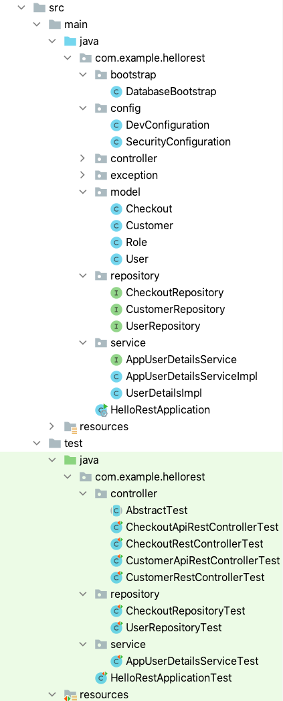
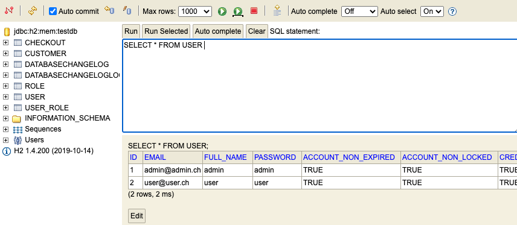

# Security-Step-1: Prerequisites for Spring Security with JWT Authentication

[Go to profiles branch](https://github.zhaw.ch/bacn/ase2-spring-boot-hellorest/tree/security-step-1)

The **securtiy-step-1 branch** has been created from the **rest**.

The **step 1** is providing a **basic prerequisite** for the stateless JWT Token Authentication Service

- add 2 dependencies
- add a _User_ and a _Role_ model class
- add a _UserRepository_ class
- add a new _liquibase_ migration file _db.changelog_3.yaml_
- add a _UserDetailsImpl_ class implements the _UserDetails_
- add an _AppUserDetailsService_ interface extending the _UserDetailsService_ interface
- add an _AddUserDetailsServiceImpl_ class implementing _AppUserDetailsService_
- add a _SecurityConfiguration_ class extending _WebSecurityConfigurerAdapter_

The _SecurityConfiguration_ provides a temporary configuration to **not have any security available**
in order to allow running the unit tests and the application like before.

<br/>

**Add new Unit Tests**

- add a _UserRepositoryTest_ class
- add a _AppUserDetailsServiceTest_ class

<br/>

##  Project Structure for Security Step 1

Create the service package
Create the packages controller, repository, service in the folder _test/java com.example.hellorest_

<br/>




<br/>

### add 2 dependencies

<br/>

Add a dependency for the spring-boot-starter-security and the JWT Library.

<br/>

```xml
      <dependency>
         <groupId>org.springframework.boot</groupId>
         <artifactId>spring-boot-starter-security</artifactId>
      </dependency>
      <dependency>
         <groupId>io.jsonwebtoken</groupId>
         <artifactId>jjwt</artifactId>
         <version>0.6.0</version>
      </dependency>
```

<br/>


### Add User model class

<br/>

```java
import java.util.HashSet;
import java.util.Set;

import javax.persistence.*;

@Entity
@Table( name="user" )
public class User {

	@Id
	@GeneratedValue(strategy = GenerationType.IDENTITY)
	private Long id;

	@Column( unique=true, nullable=false )
	private String email;

	@Column( nullable=false )
	private String password;

	private String fullName;

	public boolean accountNonExpired;

	public boolean accountNonLocked;

	public boolean credentialsNonExpired;

	public boolean enabled;

	@ManyToMany( cascade = CascadeType.ALL, fetch = FetchType.EAGER )
	@JoinTable(
		name = "user_role",
		joinColumns = {@JoinColumn(name="user_id")},
		inverseJoinColumns = {@JoinColumn(name="role_id")}
	)
	private Set<Role> roles = new HashSet<Role>();

	public User() {}

	public Long getId() {
		return id;
	}

	public void setId(Long id) {
		this.id = id;
	}

	public String getEmail() {
		return email;
	}

	public void setEmail(String email) {
		this.email = email;
	}

	public String getPassword() {
		return password;
	}

	public void setPassword(String password) {
		this.password = password;
	}

	public String getFullName() {
		return fullName;
	}

	public void setFullName(String fullName) {
		this.fullName = fullName;
	}

	public Set<Role> getRoles() {
		return roles;
	}

	public void setRoles(Set<Role> roles) {
		this.roles = roles;
	}

	public boolean isAccountNonExpired() {
		return accountNonExpired;
	}

	public void setAccountNonExpired(boolean accountNonExpired) {
		this.accountNonExpired = accountNonExpired;
	}

	public boolean isAccountNonLocked() {
		return accountNonLocked;
	}

	public void setAccountNonLocked(boolean accountNonLocked) {
		this.accountNonLocked = accountNonLocked;
	}

	public boolean isCredentialsNonExpired() {
		return credentialsNonExpired;
	}

	public void setCredentialsNonExpired(boolean credentialsNonExpired) {
		this.credentialsNonExpired = credentialsNonExpired;
	}

	public boolean isEnabled() {
		return enabled;
	}

	public void setEnabled(boolean enabled) {
		this.enabled = enabled;
	}

	@Override
	public String toString() {
		return "User [id=" + id + ", email=" + email + ", password=" + password + "]";
	}

}

```

<br/>

### Add Role model class

<br/>

```java
import javax.persistence.*;
import java.util.HashSet;
import java.util.Set;

@Entity
@Table( name = "role" )
public class Role {

	@Id
	@GeneratedValue(strategy = GenerationType.IDENTITY)
	private Long id;

	private String role;

	@ManyToMany( mappedBy = "roles")
	private Set<User> users = new HashSet<User>();

	public Role(){} //

	public Long getId() {
		return id;
	}

	public void setId(Long id) {
		this.id = id;
	}

	public String getRole() {
		return role;
	}

	public void setRole(String role) {
		this.role = role;
	}

	public Set<User> getUsers() {
		return users;
	}

	public void setUsers(Set<User> users) {
		this.users = users;
	}

	@Override
	public String toString() {
		return "Role [id=" + id + ", role=" + role + "]";
	}

}

```

<br/>


### Add a UserRepository class

<br/>

```java
import com.example.hellorest.model.User;
import org.springframework.data.repository.CrudRepository;


public interface UserRepository extends CrudRepository<User, Long> {

	User findByEmail(String email);

}

```

<br/>


### Add a new liquibase migration file db.changelog_3.yaml

<br/>

```yaml
databaseChangeLog:
  - changeSet:
      id: 6
      author: matthiasbachmann
      changes:
        - createTable:
            tableName: role
            columns:
              - column:
                  name: id
                  type: bigint
                  autoIncrement: true
                  constraints:
                    primaryKey: true
                    nullable: false
              - column:
                  name: role
                  type: varchar(255)
                  constraints:
                    nullable: false
  - changeSet:
      id: 7
      author: matthiasbachmann
      changes:
        - insert:
            tableName: role
            columns:
              - column:
                  name: role
                  value: ROLE_ADMIN
        - insert:
            tableName: role
            columns:
              - column:
                  name: role
                  value: ROLE_USER
  - changeSet:
      id: 8
      author: matthiasbachmann
      changes:
        - createTable:
            tableName: user
            columns:
              - column:
                  name: id
                  type: bigint
                  autoIncrement: true
                  constraints:
                    primaryKey: true
                    nullable: false
              - column:
                  name: email
                  type: varchar(255)
                  constraints:
                    nullable: false
              - column:
                  name: full_name
                  type: varchar(255)
                  constraints:
                    nullable: false
              - column:
                  name: password
                  type: varchar(255)
                  constraints:
                    nullable: false
              - column:
                  name: account_non_expired
                  type: boolean
                  constraints:
                    nullable: false
              - column:
                  name: account_non_locked
                  type: boolean
                  constraints:
                    nullable: false
              - column:
                  name: credentials_non_expired
                  type: boolean
                  constraints:
                    nullable: false
              - column:
                  name: enabled
                  type: boolean
                  constraints:
                    nullable: false
  - changeSet:
      id: 9
      author: matthiasbachmann
      changes:
        - insert:
            tableName: user
            columns:
              - column:
                  name: email
                  value: admin@admin.ch
              - column:
                  name: full_name
                  value: admin
              - column:
                  name: password
                  value: admin
              - column:
                  name: account_non_expired
                  value: true
              - column:
                  name: account_non_locked
                  value: true
              - column:
                  name: credentials_non_expired
                  value: true
              - column:
                  name: enabled
                  value: true
        - insert:
            tableName: user
            columns:
              - column:
                  name: email
                  value: user@user.ch
              - column:
                  name: full_name
                  value: user
              - column:
                  name: password
                  value: user
              - column:
                  name: account_non_expired
                  value: true
              - column:
                  name: account_non_locked
                  value: true
              - column:
                  name: credentials_non_expired
                  value: true
              - column:
                  name: enabled
                  value: true
  - changeSet:
      id: 10
      author: matthiasbachmann
      changes:
        - createTable:
            tableName: user_role
            columns:
              - column:
                  name: user_id
                  type: bigint
                  constraints:
                    nullable: false
              - column:
                  name: role_id
                  type: bigint
                  constraints:
                    nullable: false
  - changeSet:
      id: 11
      author: matthiasbachmann
      changes:
        - insert:
            tableName: user_role
            columns:
              - column:
                  name: user_id
                  value: 1
              - column:
                  name: role_id
                  value: 1
        - insert:
            tableName: user_role
            columns:
              - column:
                  name: user_id
                  value: 2
              - column:
                  name: role_id
                  value: 2
  - changeSet:
      id: 12
      author: matthiasbachmann
      changes:
        - addForeignKeyConstraint:
           baseColumnNames: role_id
           baseTableName: user_role
           constraintName: fk_user_role_role
           referencedColumnNames: id
           referencedTableName: role
        - addForeignKeyConstraint:
            baseColumnNames: user_id
            baseTableName: user_role
            constraintName: fk_user_role_user
            referencedColumnNames: id
            referencedTableName: user

```

<br/>


### Add a UserDetailsImpl class implements the UserDetails

<br/>

```java
import com.example.hellorest.model.Role;
import com.example.hellorest.model.User;
import org.springframework.security.core.GrantedAuthority;
import org.springframework.security.core.authority.SimpleGrantedAuthority;
import org.springframework.security.core.userdetails.UserDetails;

import java.util.Collection;
import java.util.HashSet;
import java.util.Set;


public class UserDetailsImpl implements UserDetails {

	private static final long serialVersionUID = 3185970362329652822L;

	private final User user;

	public UserDetailsImpl(User user){
		this.user = user;
	}

	@Override
	public Collection<? extends GrantedAuthority> getAuthorities() {
		Collection<GrantedAuthority> authorities = new HashSet<GrantedAuthority>();
		Set<Role> roles = user.getRoles();
		for( Role role : roles ) {
			authorities.add( new SimpleGrantedAuthority(role.getRole()) );
		}
		return authorities;
	}

	@Override
	public String getPassword() {
		return user.getPassword();
	}

	@Override
	public String getUsername() {
		return user.getEmail();
	}

	@Override
	public boolean isAccountNonExpired() {
		return user.isAccountNonExpired();
	}

	@Override
	public boolean isAccountNonLocked() {
		return user.isAccountNonLocked();
	}

	@Override
	public boolean isCredentialsNonExpired() {
		return user.isCredentialsNonExpired();
	}

	@Override
	public boolean isEnabled() {
		return user.isEnabled();
	}

}

```

<br/>


### Add an AppUserDetailsService interface extending the UserDetailsService interface

<br/>

```java
import com.example.hellorest.model.User;
import org.springframework.security.core.userdetails.UserDetailsService;


public interface AppUserDetailsService extends UserDetailsService{

	public User findByEmail(String email);

}

```

<br/>

### Add an AddUserDetailsServiceImpl class implementing AppUserDetailsService

<br/>

```java
package com.example.hellorest.service;

import com.example.hellorest.model.User;
import com.example.hellorest.repository.UserRepository;
import org.springframework.beans.factory.annotation.Autowired;
import org.springframework.security.core.userdetails.UserDetails;
import org.springframework.security.core.userdetails.UsernameNotFoundException;
import org.springframework.stereotype.Service;


@Service
public class AppUserDetailsServiceImpl implements AppUserDetailsService {

	private final UserRepository userRepository;

	@Autowired
	public AppUserDetailsServiceImpl(UserRepository userRepository){
		this.userRepository = userRepository;
	}

	@Override
	public User findByEmail(String email) {
		return userRepository.findByEmail(email);
	}

	@Override
	public UserDetails loadUserByUsername(String username) throws UsernameNotFoundException {
		User user = findByEmail(username);
		if( user == null ){
			throw new UsernameNotFoundException(username);
		}
		return new UserDetailsImpl(user);
	}
}

```

<br/>

### Add a SecurityConfiguration class extending WebSecurityConfigurerAdapter

The SecurityConfiguration provides a temporary configuration to **not have any security available**
in order to allow running the unit tests and the application like before.

<br/>

```java
import org.springframework.context.annotation.Configuration;
import org.springframework.security.config.annotation.web.builders.WebSecurity;
import org.springframework.security.config.annotation.web.configuration.EnableWebSecurity;
import org.springframework.security.config.annotation.web.configuration.WebSecurityConfigurerAdapter;
import org.springframework.web.servlet.config.annotation.EnableWebMvc;


@Configuration
@EnableWebSecurity
@EnableWebMvc
public class SecurityConfiguration extends WebSecurityConfigurerAdapter {


    @Override
    public void configure(WebSecurity web) throws Exception {
        web.ignoring().mvcMatchers("/**");
    }

}

```

<br/>

You should be able to start the application and check all links.

<br/>

Open the H2-Console and check it the new tables are available:

<br/>



<br/>

You should find 3 new tables in the database:

- USER Table
- ROLE Table
- USER_ROLE Table

<br/>

### Add a UserRepositoryTest class

<br/>

```java
import com.example.hellorest.model.User;
import org.junit.jupiter.api.Test;
import org.springframework.beans.factory.annotation.Autowired;
import org.springframework.boot.test.context.SpringBootTest;

import static org.junit.jupiter.api.Assertions.assertEquals;
import static org.junit.jupiter.api.Assertions.assertTrue;


@SpringBootTest
public class UserRepositoryTest {

    @Autowired
    UserRepository userRepository;

    @Test
    public void getAdmin() {
        User user = userRepository.findByEmail("admin@admin.ch");
        assertEquals(user.getEmail(), "admin@admin.ch");
        assertTrue(user.getRoles().stream().anyMatch(role -> role.getRole().equals("ROLE_ADMIN")));
    }

    @Test
    public void getUser() {
        User user = userRepository.findByEmail("user@user.ch");
        assertEquals(user.getEmail(), "user@user.ch");
        assertTrue(user.getRoles().stream().anyMatch(role -> role.getRole().equals("ROLE_USER")));
    }
}

```

<br/>

### add a AppUserDetailsServiceTest class

<br/>

```java
import org.junit.jupiter.api.Test;
import org.springframework.beans.factory.annotation.Autowired;
import org.springframework.boot.test.context.SpringBootTest;

import static org.junit.jupiter.api.Assertions.assertEquals;

@SpringBootTest
public class AppUserDetailsServiceTest {

    @Autowired
    AppUserDetailsService appUserDetailsService;

    @Test
    public void loadUser() {
        UserDetailsImpl userDetailsImpl = (UserDetailsImpl)appUserDetailsService.loadUserByUsername("admin@admin.ch");
        assertEquals(userDetailsImpl.getUsername(),"admin@admin.ch");

    }
}

```

<br/>

