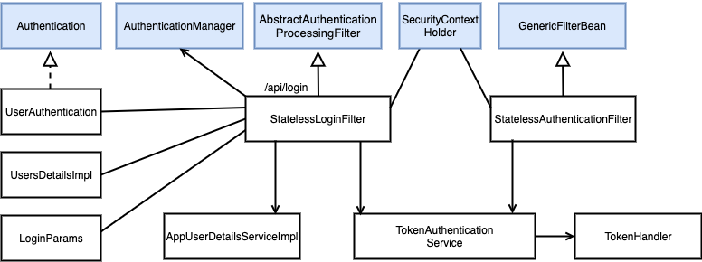
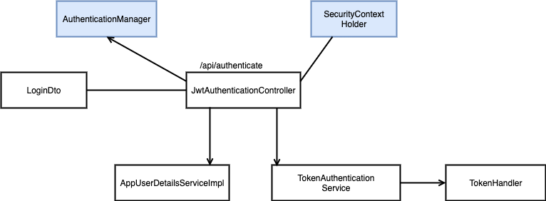
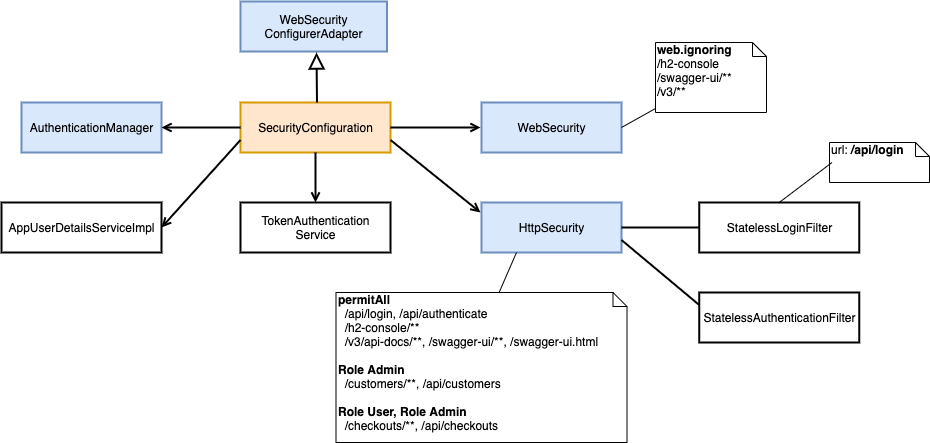
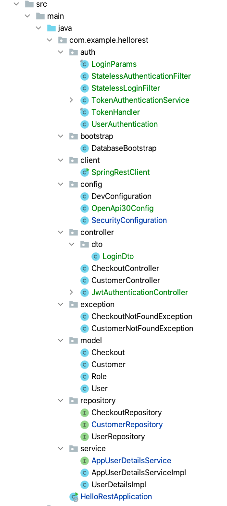
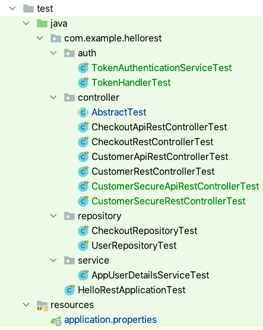

# Security-Step-2: Secure the endpoints with JWT Authentication


| [master](master.md)
| [database-bootstrap](database-bootstrap.md)
| [flyway](flyway.md)
| [liquibase](liquibase.md)
| [profiles](profiles.md)
| [docker](docker.md)
| [rest](rest.md)
| [security-step-1](security-step-1.md)
| [security-step-2]()
|

[Go to security-step-2 branch](https://github.zhaw.ch/bacn/ase2-spring-boot-hellorest/tree/security-step-2)

The **securtiy-step-2 branch** has been created from the **securtiy-step-1 branch**.

The **securtiy-step-2** is providing a **complete solution** for securing the endpoints with _JWT Authentication_.
New user registration, password reset, sending a confirmation or password reset email is not yet provided in this tutorial.

The login can be done through two different end points:

- **/api/login** - The login is handled by a StatelessLoginFilter (part of the spring boot filter chain)
- **/api/authenticate** - The login is handled by the JwtAuthenticationController which is a normal RestController

The second option is necessary in order to allow a login through the _OpenApi_ web application. In a practical project implementing one solution is enough.

## Option 1: Login with a StatelessLoginFilter (part of the spring boot filter chain)

The _StatelessLoginFilter_ is registered by the _SecurityConfiguration_ in the filter chain. The url is **/api/login**.

<br/>



<br/>

The _StatelessLoginFilter_ gets access to the _AuthenticationManager_. It receives the email and password in the body of the POST-Request.
The _LoginParams_ model is used to hold the email and password as an object. This allows us to create a _UsernamePasswordAuthenticationToken_ and
to authenticate this information with the _AuthenticationManager_. At successful authentication, the _UserDetails_ is loaded by the _AppUserDetailsServiceImpl_
and converted to a _UserAuthentication_. The _TokenAuthenticationService_ is adding the _JWT Token_ to the response header.
The _UserAuthentication_ is added to the _SecurityContext_ through the _SecurityContextHolder_.

## Option 2: Login with a JwtAuthenticationController (a normal RestController)

The JwtAuthenticationController is listening at **/api/authenticate**.

<br/>



<br/>

The _JwtAuthenticationController_ gets access to the _AuthenticationManager_. It receives the email and password in the body of the _POST-Request_.
The _LoginDto_ model is used to hold the email and password as an object. This allows us creating a _UsernamePasswordAuthenticationToken_ and
authenticating this information with the _AuthenticationManager_. At successful authentication, the _UserDetails_ is extracted from the _Authentication_
and converted to a _UserAuthentication_. The _TokenAuthenticationService_ is adding the _JWT Token_ to the response header.
The _UserAuthentication_ is added to the _SecurityContext_ through the _SecurityContextHolder_.


## Configuring the Security with the SecurityConfiguration

Configuring the security in spring boot is done by a SecurityConfiguration class which extends the WebSecurityConfigurerAdapter.

<br/>



<br/>

The _SecurityConfiguration_ gets access to the _TokenAuthentication_ Service and _AppUserDetailsServiceImpl_ class.

- **WebSecurity**: Which url's are **NOT** processed by the _Security Filter Chain_
- **HttpSecurity**: What roles are necessary to access an end point


### Adding CORS Support to the SecurityConfiguration

Is is about _Enabling Cross Origin Requests_ for a _RESTful_ Web Service.
Currently, client-side scripts (e.g., JavaScript) are prevented from accessing much of the Web of _Linked Data_
due to "same origin" restrictions implemented in all major Web browsers.
_Cross-origin_ resource sharing (CORS) is a _W3C_ specification implemented by most browsers
that allows you to specify in a flexible way what kind of cross domain requests are authorized

Granting _JavaScript_ clients basic access to your resources simply requires adding one _HTTP Response Header_, namely:

```
 Access-Control-Allow-Origin: *
 Access-Control-Allow-Origin: http://example.com:8080
```

The _CORS Support_ is available in the _SecurityConfiguration_ class as a _Bean_.

### Adding a Password Encoder to the SecurityConfiguration

The _SecurityConfiguration_ contains a _PasswordEncoder_ class. In our example the _PasswordEncoder_ allows using unencoded passwords from the database.
Our _liquibase change set_ saves the password without a _hashcode_. This is not usable for a real world project. Use instead a _BCryptPasswordEncoder_.

<br/>

## To do in this step

- [Add a JWT TokenHandler](#add-a-jwt-tokenhander)
- [Add a TokenAuthenticationService](#add-a-tokenauthenticationservice)
- [Add a LoginParams DTO for email and password](#add-a-loginparams-dto-for-email-and-password)
- [Add a UserAuthentication](#add-a-userauthentication)
- [Add a StatelessLoginFilter (checks the email/password and creates a JWT Token)](#add-a-statelessloginfilter)
- [Add a StatelessAuthenticationFilter (check the validity of the Token)](#add-a-statelessauthenticationfilter-check-the-validity-of-the-token)
- [Add a SecurityConfiguration](#add-a-securityconfiguration)
- [Add a LoginDto](#add-a-logindto)
- [Add a JwtAuthenticationController](#add-a-jwtauthenticationcontroller)
- [Add an OpenApi30Config](#add-an-openapi30config)
- [Remove the OpenApi Bean from the HelloRestApplication](#remove-the-openapi-bean-from-the-hellorestapplication)
- [Add new properties to application.properties](#add-new-properties-to-applicationproperties)


**Add new Integration Tests**

- [Add a TokenHandlerTest](#add-a-tokenhandlertest)
- [Add a TokenAuthenticationServiceTest](#add-a-tokenauthenticationservicetest)
- [Change the AbstractTest (create a secure TestWebContext)](#change-the-abstracttest-create-a-secure-testwebcontext)
- [Add a CustomerSecureApiRestControllerTest](#add-a-customersecureapirestcontrollertest)
- [Add a CustomerSecureRestControllerTest](#add-a-customersecurerestcontrollertest)


**Use the Spring RestTemplate for accessing the endpoints**

With the Spring RestTemplate we can access the end points through a RestClient.

- [Add a SpringRestClient](#add-a-springrestclient)


##  Project Structure for Security Step 2

A new package auth has been added:

<br/>



<br/>

### Add a JWT TokenHander

The TokenHander is providing three main methods:

- _public String createTokenForUser(UserDetails userDetails)_: Signing a Token.
- _public UserDetails parseUserFromToken(String token)_: Checking the Signature and returning the _UserDetails_.
- _public Claims parseClaimsFromToken(String token)_: Checking the Signature and returning the _Claims_.


<br/>

```java
import java.util.Base64;
import java.util.Date;
import java.util.UUID;
import java.util.concurrent.TimeUnit;

import io.jsonwebtoken.Claims;
import org.springframework.security.core.userdetails.UserDetails;
import org.springframework.security.core.userdetails.UserDetailsService;

import io.jsonwebtoken.Jwts;
import io.jsonwebtoken.SignatureAlgorithm;

public final class TokenHandler {

    private final String secret;
    private final UserDetailsService userDetailsService;

    public TokenHandler(String secret, UserDetailsService userDetailsService) {
        this.secret = Base64.getEncoder().encodeToString(secret.getBytes());
        this.userDetailsService = userDetailsService;
     }

    public UserDetails parseUserFromToken(String token) {
        String username = Jwts.parser()
                .setSigningKey(secret)
                .parseClaimsJws(token)
                .getBody()
                .getSubject();
        System.out.println(username);
        return userDetailsService.loadUserByUsername(username);
     }

    public Claims parseClaimsFromToken(String token) {
        return Jwts.parser()
                .setSigningKey(secret)
                .parseClaimsJws(token).getBody();

    }

    public String createTokenForUser(UserDetails userDetails) {
        Date now = new Date();
        Claims claims = Jwts.claims().setSubject(userDetails.getUsername());
        claims.put("roles", userDetails.getAuthorities());
        Date expiration = new Date(now.getTime() + TimeUnit.HOURS.toMillis(10l));
        return Jwts.builder()
                .setId(UUID.randomUUID().toString())
                .setSubject(userDetails.getUsername())
                .setClaims(claims)
                .setIssuedAt(now)
                .setExpiration(expiration)
                .signWith(SignatureAlgorithm.HS512, secret)
                .compact();
    }
}
```

<br/>

### Add a TokenAuthenticationService

The TokenAuthenticationService is providing two main methods:

- _public String addAuthentication(HttpServletResponse response, UserAuthentication authentication)_: Adding the _JWT-Token_ to the _response header_ and returning the token.
- _public Authentication getAuthentication(HttpServletRequest request)_: Extracting the token from the _request header_, parsing and extracting the _UserAuthentication_ from it.

<br/>

```java
import javax.servlet.http.HttpServletRequest;
import javax.servlet.http.HttpServletResponse;

import org.springframework.security.core.Authentication;
import org.springframework.security.core.userdetails.UserDetails;
import org.springframework.security.core.userdetails.UserDetailsService;

public class TokenAuthenticationService {

    public enum AuthHeaderName {
        xauth("X-AUTH-TOKEN"),
        bearer("Authorization");

        private final String headerName;

        AuthHeaderName(String headerName) {
            this.headerName = headerName;
        }

        public String getHeaderName() {
            return headerName;
        }
    }

    private final AuthHeaderName authHeaderName;
    private final String bearer = "Bearer ";
    private TokenHandler tokenHandler = null;

    public TokenAuthenticationService(AuthHeaderName authHeaderName, String secret, UserDetailsService userDetailsService) {
        tokenHandler = new TokenHandler(secret, userDetailsService);
        this.authHeaderName = authHeaderName;
    }

    public String addAuthentication(HttpServletResponse response, UserAuthentication authentication) {
        final UserDetails userDetails = authentication.getDetails();
        String token = tokenHandler.createTokenForUser(userDetails);
        if (authHeaderName == AuthHeaderName.bearer) token = bearer + token;
            response.addHeader(authHeaderName.getHeaderName(), token);
        return token;
    }

    public Authentication getAuthentication(HttpServletRequest request) {
        String token = request.getHeader(authHeaderName.getHeaderName());
        if (token != null) {
            if (authHeaderName == AuthHeaderName.bearer) token = token.substring(bearer.length()).trim();
            final UserDetails userDetails = tokenHandler.parseUserFromToken(token);
            if (userDetails != null) {
                return new UserAuthentication(userDetails);
            }
        }
        return null;
    }
}
```

<br/>

### Add a LoginParams DTO for email and password

The _LoginParams_ is a model class containing the properties _email_ and _password_. The method _toAuthenticationToken_ can create a _UsernamePasswordAuthenticationToken_.

<br/>

```java
import com.fasterxml.jackson.annotation.JsonProperty;

import org.springframework.security.authentication.UsernamePasswordAuthenticationToken;
import org.springframework.security.crypto.bcrypt.BCryptPasswordEncoder;

import javax.validation.constraints.Size;
import java.util.Optional;


public final class LoginParams {

    private final String email;
    @Size(min = 8, max = 100)
    private final String password;

    public LoginParams(@JsonProperty("email") String email,
                       @JsonProperty("password") String password) {
        this.email = email;
        this.password = password;
     }

    public Optional<String> getEmail() {
        return Optional.ofNullable(email);
    }

    public Optional<String> getEncodedPassword() {
        return Optional.ofNullable(password).map(p -> new BCryptPasswordEncoder().encode(p));
    }

    public UsernamePasswordAuthenticationToken toAuthenticationToken() {
        return new UsernamePasswordAuthenticationToken(email, password);
    }

}
```

<br/>

### Add a UserAuthentication

The _UserAuthentication_ class implements the _spring_ standard interface _Authentication_ providing all  
necessary information including the _GrantedAuthorities_ through the _getAuthorities()_ method.

<br/>

```java
import java.util.Collection;

import org.springframework.security.core.Authentication;
import org.springframework.security.core.GrantedAuthority;
import org.springframework.security.core.userdetails.UserDetails;

public class UserAuthentication implements Authentication {

	private static final long serialVersionUID = -7998669375957622012L;
	private final UserDetails userDetails;
    private boolean authenticated = true;

    public UserAuthentication(UserDetails userDetails) {
        this.userDetails = userDetails;
    }

    @Override
    public String getName() {
        return userDetails.getUsername();
    }

    @Override
    public Collection<? extends GrantedAuthority> getAuthorities() {
        return userDetails.getAuthorities();
    }

    @Override
    public Object getCredentials() {
        return userDetails.getPassword();
    }

    @Override
    public UserDetails getDetails() {
        return userDetails;
    }

    @Override
    public Object getPrincipal() {
        return userDetails.getUsername();
    }

    @Override
    public boolean isAuthenticated() {
        return authenticated;
    }

    @Override
    public void setAuthenticated(boolean authenticated) {
        this.authenticated = authenticated;
    }
}
```

<br/>

### Add a StatelessLoginFilter

The StatelessLoginFilter extends the AbstractAuthenticationProcessingFilter and overrides two methods:

- _Authentication attemptAuthentication()_: Is trying to authenticate through the _POST-request_ information _email_ and _password_.
- _successfulAuthentication()_: loads the _UserDetails_ from the database, creates a _JWT-Token_ and add the authentication to the _SecurityContext_.

<br/>

```java
import com.fasterxml.jackson.databind.ObjectMapper;

import org.springframework.security.authentication.AuthenticationManager;
import org.springframework.security.authentication.UsernamePasswordAuthenticationToken;
import org.springframework.security.core.Authentication;
import org.springframework.security.core.AuthenticationException;
import org.springframework.security.core.context.SecurityContextHolder;
import org.springframework.security.core.userdetails.UserDetails;
import org.springframework.security.core.userdetails.UserDetailsService;
import org.springframework.security.web.authentication.AbstractAuthenticationProcessingFilter;

import javax.servlet.FilterChain;
import javax.servlet.ServletException;
import javax.servlet.http.HttpServletRequest;
import javax.servlet.http.HttpServletResponse;
import java.io.IOException;

public class StatelessLoginFilter extends AbstractAuthenticationProcessingFilter {

    private final TokenAuthenticationService tokenAuthenticationService;
    private final UserDetailsService userDetailsService;

    public StatelessLoginFilter(String urlMapping,
                         TokenAuthenticationService tokenAuthenticationService,
                         UserDetailsService userService,
                         AuthenticationManager authenticationManager) {
        super(urlMapping);
        this.tokenAuthenticationService = tokenAuthenticationService;
        this.userDetailsService = userService;
        setAuthenticationManager(authenticationManager);
    }

    @Override
    public Authentication attemptAuthentication(HttpServletRequest request,
                                                HttpServletResponse response) throws AuthenticationException, IOException, ServletException {

    	final LoginParams params = new ObjectMapper().readValue(request.getInputStream(), LoginParams.class);
        final UsernamePasswordAuthenticationToken loginToken = params.toAuthenticationToken();
        return getAuthenticationManager().authenticate(loginToken);
    }

    @Override
    protected void successfulAuthentication(HttpServletRequest request,
                                            HttpServletResponse response,
                                            FilterChain chain,
                                            Authentication authResult) throws IOException, ServletException {
        final UserDetails authenticatedUser = userDetailsService.loadUserByUsername(authResult.getName());
        final UserAuthentication userAuthentication = new UserAuthentication(authenticatedUser);

        // add the JWT token to the response header
        tokenAuthenticationService.addAuthentication(response, userAuthentication);

        SecurityContextHolder.getContext().setAuthentication(userAuthentication);
        System.out.println("successful authentication");
    }
}
```

<br/>

### Add a StatelessAuthenticationFilter (check the validity of the Token)

The StatelessAuthenticationFilter extends the GenericFilterBean and overrides one method:

- doFilter(): Get an Authentication through the tokenAuthenticationService.getAuthentication() method. The Token is extracted from the request header and parsed.

<br/>

```java
import java.io.IOException;

import javax.servlet.FilterChain;
import javax.servlet.ServletException;
import javax.servlet.ServletRequest;
import javax.servlet.ServletResponse;
import javax.servlet.http.HttpServletRequest;
import javax.servlet.http.HttpServletResponse;

import org.springframework.security.core.Authentication;
import org.springframework.security.core.AuthenticationException;
import org.springframework.security.core.context.SecurityContextHolder;
import org.springframework.web.filter.GenericFilterBean;

import io.jsonwebtoken.JwtException;

public class StatelessAuthenticationFilter extends GenericFilterBean {

	private final TokenAuthenticationService tokenAuthenticationService;

	public StatelessAuthenticationFilter(TokenAuthenticationService tokenAuthenticationService) {
		this.tokenAuthenticationService = tokenAuthenticationService;
	}

	@Override
	public void doFilter(ServletRequest request, ServletResponse response, FilterChain filterChain)
			throws IOException, ServletException {

		try {
			Authentication authentication = tokenAuthenticationService.getAuthentication((HttpServletRequest) request);
			SecurityContextHolder.getContext().setAuthentication(authentication);
			if (authentication != null) System.out.println(authentication.getAuthorities());
			filterChain.doFilter(request, response);

		} catch (AuthenticationException | JwtException e) {
			System.out.println("JwtException");
			SecurityContextHolder.clearContext();
			((HttpServletResponse) response).setStatus(HttpServletResponse.SC_UNAUTHORIZED);
		}
	}
}
```

<br/>

### Add a SecurityConfiguration

The SecurityConfiguration contains the following Beans:

- PasswordEncoder: Is a demo implementation without a crypto for supporting unencoded passwords in the database (**NOT recommended**)
- TokenAuthenticationService: Is providing a Singleton through the application for this service
- AuthenticationManager: Is providing a Singleton through the application for this service
- CorsFilter: Is configuring CORS

The configuration through the overridden configure-methods is done by

- configure(WebSecurity web): Which url's should not be processed by the security filter chain
- configure(HttpSecurity http): Which url's need which roles to get accessed (url based security)
- configure(AuthenticationManagerBuilder auth): Is providing our UserDetailsServiceImpl for the Authentication

<br/>

```java
import com.example.hellorest.auth.StatelessAuthenticationFilter;
import com.example.hellorest.auth.StatelessLoginFilter;
import com.example.hellorest.auth.TokenAuthenticationService;
import org.springframework.beans.factory.annotation.Autowired;
import org.springframework.beans.factory.annotation.Qualifier;
import org.springframework.beans.factory.annotation.Value;
import org.springframework.context.annotation.Bean;
import org.springframework.context.annotation.Configuration;
import org.springframework.http.HttpMethod;
import org.springframework.security.authentication.AuthenticationManager;
import org.springframework.security.config.annotation.authentication.builders.AuthenticationManagerBuilder;
import org.springframework.security.config.annotation.web.builders.HttpSecurity;
import org.springframework.security.config.annotation.web.builders.WebSecurity;
import org.springframework.security.config.annotation.web.configuration.EnableWebSecurity;
import org.springframework.security.config.annotation.web.configuration.WebSecurityConfigurerAdapter;
import org.springframework.security.config.http.SessionCreationPolicy;
import org.springframework.security.core.userdetails.UserDetailsService;
import org.springframework.security.crypto.password.PasswordEncoder;
import org.springframework.security.web.authentication.UsernamePasswordAuthenticationFilter;
import org.springframework.web.cors.CorsConfiguration;
import org.springframework.web.cors.UrlBasedCorsConfigurationSource;
import org.springframework.web.filter.CorsFilter;
import org.springframework.web.servlet.config.annotation.EnableWebMvc;

@Configuration
@EnableWebSecurity
@EnableWebMvc
public class SecurityConfiguration extends WebSecurityConfigurerAdapter {

    private final UserDetailsService userService;
    private final TokenAuthenticationService tokenAuthenticationService;

    private TokenAuthenticationService.AuthHeaderName  authHeaderName;

    @Autowired
    public SecurityConfiguration(@Qualifier("appUserDetailsServiceImpl") UserDetailsService userDetailsService,
                                 @Value("${hellorest.auth.secret:secretkey}") String secretKey,
                                 @Value("${hellorest.auth.headername:xauth}") TokenAuthenticationService.AuthHeaderName  authHeaderName) {

        super(true);
        this.userService = userDetailsService;
        tokenAuthenticationService = new TokenAuthenticationService(authHeaderName, secretKey, userDetailsService);
    }


    @Bean
    public PasswordEncoder passwordEncoder() {
        return new PasswordEncoder() {
            @Override
            public String encode(CharSequence rawPassword) {
                return rawPassword.toString();
            }
            @Override
            public boolean matches(CharSequence rawPassword, String encodedPassword) {
                return rawPassword.toString().equals(encodedPassword);
            }
        };
    }

    @Bean
    public TokenAuthenticationService tokenAuthenticationService() {
        return tokenAuthenticationService;
    }

    @Override
    protected void configure(HttpSecurity http) throws Exception {

        http.csrf().disable();

        //h2 database console
        http.headers().frameOptions().disable()
                .and()
                    .sessionManagement()
                    .sessionCreationPolicy(SessionCreationPolicy.STATELESS);

        http.exceptionHandling()
                .and().anonymous()
                .and().servletApi()
                .and().headers().cacheControl();

        http.authorizeRequests()
                .antMatchers("/api/login", "/api/authenticate").permitAll()
                .antMatchers("/customers", "/customers/**").hasRole("ADMIN")
                .antMatchers("/checkouts", "/checkouts/**").hasAnyRole("USER", "ADMIN")
                .antMatchers("/api/customers/**").hasRole("ADMIN")
                .antMatchers("/api/checkouts/**").hasAnyRole("USER", "ADMIN")
                .antMatchers("/v3/api-docs/**", "/swagger-ui/**", "/swagger-ui.html").permitAll()
                .antMatchers(HttpMethod.GET, "/h2-console/**").permitAll();

        http.addFilterBefore(
                new StatelessLoginFilter("/api/login", tokenAuthenticationService, userService, authenticationManager()),
                UsernamePasswordAuthenticationFilter.class);

        http.addFilterBefore(
                new StatelessAuthenticationFilter(tokenAuthenticationService),
                UsernamePasswordAuthenticationFilter.class);
    }

    @Bean
    @Override
    public AuthenticationManager authenticationManagerBean() throws Exception {
        return super.authenticationManagerBean();
    }

    @Override
    protected void configure(AuthenticationManagerBuilder auth) throws Exception {
        // auth.userDetailsService(userDetailsService()).passwordEncoder(new BCryptPasswordEncoder());
        auth.userDetailsService(userService);
    }

    @Override
    protected UserDetailsService userDetailsService() {
        return userService;
    }

    /* To allow Pre-flight [OPTIONS] request from browser */
    @Override
    public void configure(WebSecurity web) throws Exception {
        web.ignoring()
                .antMatchers(HttpMethod.OPTIONS, "/**")
                .antMatchers("/h2-console/**")
                .antMatchers("/swagger-ui.html")
                .antMatchers("/swagger-ui/**")
                .antMatchers("/v3/**");
    }

    @Bean
    public CorsFilter corsFilter() {
        final UrlBasedCorsConfigurationSource source = new UrlBasedCorsConfigurationSource();
        final CorsConfiguration config = new CorsConfiguration();
        config.setAllowCredentials(false);
        config.addAllowedOrigin("*");
        config.addAllowedHeader("Authorization");
        config.addAllowedHeader("X-AUTH-TOKEN");
        config.addAllowedHeader("Content-Type");
        config.addAllowedMethod("OPTIONS");
        config.addAllowedMethod("GET");
        config.addAllowedMethod("POST");
        config.addAllowedMethod("PUT");
        config.addAllowedMethod("DELETE");
        config.addAllowedMethod("PATCH");
        source.registerCorsConfiguration("/**", config);
        return new CorsFilter(source);
    }

}

```

<br/>

### Add a LoginDto

The _LoginDto_ is a model class containing the properties _email_ and _password_.

<br/>

```java

import javax.validation.constraints.NotNull;
import javax.validation.constraints.Size;

/**
 * View Model object for storing a user's credentials.
 */
public class LoginDto {

    @NotNull
    @Size(min = 1, max = 50)
    private String email;

    @NotNull
    @Size(min = 4, max = 100)
    private String password;


    public String getEmail() {
        return email;
    }

    public void setEmail(String email) {
        this.email = email;
    }

    public String getPassword() {
        return password;
    }

    public void setPassword(String password) {
        this.password = password;
    }


    // prettier-ignore
    @Override
    public String toString() {
        return "LoginVM{" +
                "username='" + email + '\'' +
                '}';
    }
}

```

<br/>

### Add a JwtAuthenticationController

The _JwtAuthenticationController_ is a standard _RestController_ providing one end point **/api/authenticate**. It receives the _email_ and _password_ in the body of the _POST-Request_.
The _LoginDto_ model is used to hold the email and password as an object. The _AuthenticationManager_ is providing the authentication containing the _authenticatedUserDetails_.
The _JWT-Token_ is added to the _request header_ and to the _body of the response_.

The static class _JWTToken_ is returning the token with a _@JsonProperty("id_token")_.

<br/>

```java
import com.example.hellorest.auth.TokenAuthenticationService;
import com.example.hellorest.auth.UserAuthentication;
import com.example.hellorest.controller.dto.LoginDto;
import com.example.hellorest.service.UserDetailsImpl;
import com.fasterxml.jackson.annotation.JsonProperty;

import javax.servlet.http.HttpServletResponse;
import javax.validation.Valid;

import org.springframework.beans.factory.annotation.Qualifier;
import org.springframework.beans.factory.annotation.Value;
import org.springframework.security.authentication.AuthenticationManager;
import org.springframework.security.authentication.UsernamePasswordAuthenticationToken;
import org.springframework.security.core.Authentication;
import org.springframework.security.core.context.SecurityContextHolder;
import org.springframework.security.core.userdetails.UserDetailsService;
import org.springframework.web.bind.annotation.*;

/**
 * Controller to authenticate users.
 */
@RestController
@RequestMapping("/api")
public class JwtAuthenticationController {

    private final TokenAuthenticationService tokenAuthenticationService;
    private final AuthenticationManager authenticationManagerBean;

    public JwtAuthenticationController(@Qualifier("appUserDetailsServiceImpl") UserDetailsService userDetailsService,
                                       @Value("${hellorest.auth.headername:xauth}") TokenAuthenticationService.AuthHeaderName  authHeaderName,
                                       @Value("${hellorest.auth.secret:secretkey}") String secretKey,
                                       AuthenticationManager authenticationManagerBean) {

        this.tokenAuthenticationService = new TokenAuthenticationService(authHeaderName, secretKey, userDetailsService);
        this.authenticationManagerBean = authenticationManagerBean;
    }

    @PostMapping("/authenticate")
    public JWTToken authorize(@Valid @RequestBody LoginDto loginDto, HttpServletResponse response) {
        UsernamePasswordAuthenticationToken authenticationToken = new UsernamePasswordAuthenticationToken(
                loginDto.getEmail(),
                loginDto.getPassword()
        );
        final Authentication authentication = authenticationManagerBean.authenticate(authenticationToken);
        final UserDetailsImpl authenticatedUserDetails = (UserDetailsImpl)authentication.getPrincipal();
        final UserAuthentication userAuthentication = new UserAuthentication(authenticatedUserDetails);

        // add the JWT token to the response header
        final String jwt = tokenAuthenticationService.addAuthentication(response, userAuthentication);

        SecurityContextHolder.getContext().setAuthentication(userAuthentication);
        System.out.println("successful authentication");
        return new JWTToken(jwt);
    }

    /**
     * Object to return as body in JWT Authentication.
     */
    static class JWTToken {

        private String idToken;

        JWTToken(String idToken) {
            this.idToken = idToken;
        }

        @JsonProperty("id_token")
        String getIdToken() {
            return idToken;
        }

        void setIdToken(String idToken) {
            this.idToken = idToken;
        }
    }
}

```

<br/>

### Add an OpenApi30Config

The _OpenApi30Config_ class is used to configure the _JWT bearer security scheme_. The _OpenApi_ frontend has an _authorize button_.
It allows us to copy paste the token (without the keyword _Bearer_) to the _authorize dialog_. At the following requests, the
_OpenApi_ is adding the Token (through the _Authorization request header_).

<br/>

```java
import io.swagger.v3.oas.models.Components;
import io.swagger.v3.oas.models.OpenAPI;
import io.swagger.v3.oas.models.info.Info;
import io.swagger.v3.oas.models.security.SecurityRequirement;
import io.swagger.v3.oas.models.security.SecurityScheme;
import org.apache.commons.lang3.StringUtils;
import org.springframework.beans.factory.annotation.Value;
import org.springframework.context.annotation.Bean;
import org.springframework.context.annotation.Configuration;
import org.springframework.context.annotation.Profile;

@Profile("dev")
@Configuration
public class OpenApi30Config {

    private final String moduleName;
    private final String apiVersion;

    public OpenApi30Config(
            @Value("${spring.application.name}") String moduleName,
            @Value("${springdoc.version}") String apiVersion) {
        this.moduleName = moduleName;
        this.apiVersion = apiVersion;
    }
    @Profile("dev")
    @Bean
    public OpenAPI customOpenAPI() {
        final String securitySchemeName = "bearerAuth";
        final String apiTitle = String.format("%s API", StringUtils.capitalize(moduleName));
        return new OpenAPI()
                .addSecurityItem(new SecurityRequirement().addList(securitySchemeName))
                .components(
                        new Components()
                                .addSecuritySchemes(securitySchemeName,
                                        new SecurityScheme()
                                                .name(securitySchemeName)
                                                .type(SecurityScheme.Type.HTTP)
                                                .scheme("bearer")
                                                .bearerFormat("JWT")
                                )
                )
                .info(new Info().title(apiTitle).version(apiVersion));
    }
}

```

<br/>

### Remove the OpenApi Bean from the HelloRestApplication

Since we have a new _OpenApi30Config_ configuration class, we can remove the _OpenApi_ configuration from the _HelloRestApplication_ class.

<br/>

```java
import org.springframework.beans.factory.annotation.Autowired;
import org.springframework.boot.SpringApplication;
import org.springframework.boot.autoconfigure.SpringBootApplication;
import org.springframework.core.env.Environment;

import javax.annotation.PostConstruct;
import java.util.Arrays;

@SpringBootApplication
public class HelloRestApplication {

    @Autowired
    private Environment env;

    public static void main(String[] args) {
        SpringApplication.run(HelloRestApplication.class, args);
    }

    @PostConstruct
    public void afterInit() {
        boolean hasDevProfile = Arrays.asList(env.getActiveProfiles()).contains("dev");
        boolean hasH2Database = Arrays.asList(env.getActiveProfiles()).contains("h2");
        String applicationName = env.getProperty("spring.application.name");
        String openApiInfo="";
        String h2ConsoleInfo="";
        if (hasDevProfile) {
            openApiInfo = "http://localhost:8080/v3/api-docs\n" +
                    "http://localhost:8080/v3/api-docs.yaml -> yaml file is downloaded -> https://editor.swagger.io/\n" +
                    "http://localhost:8080/swagger-ui.html \n";
        }
        if (hasH2Database) {
            h2ConsoleInfo= "http://localhost:8080/h2-console  " + "" +
                    "-> mit Generic H2 (Embedded), org.h2.Driver, jdbc:h2:mem:testdb und sa \n";
        }
        System.out.println("\n\nApplication [" + applicationName + "] - Enter in Browser:\nhttp://localhost:8080 or http://localhost:8080/api/customers/ \n" +
                openApiInfo +
                h2ConsoleInfo + "\n" +
                "Active Profiles: " + Arrays.toString(env.getActiveProfiles()) + "\n\n");
    }

}

```

<br/>

### Add new properties to application.properties

The new properties are:

```
hellorest.auth.headername=bearer
hellorest.auth.secret=${SECRET_KEY:secretkey}
```

_hellorest.auth.headername_ provides the option for _xauth_ or _bearer_ authentication.
_xauth_ adds the _JWT-Token_ to a _X-AUTH-TOKEN_ header and _bearer_ adds the _JWT-Token_ to an _AUTHORIZATION_ header with the keyword _Bearer_.

<br/>

```
spring.profiles.active=${ACTIVE_PROFILES:dev,h2}

spring.application.name=${APP_NAME:Hello Rest}

# spring.liquibase.change-log=classpath:/db/changelog/db.changelog-master.yaml
spring.liquibase.change-log=classpath:/db/changelog-option2/master.yaml

springdoc.api-docs.enabled=false


hellorest.auth.headername=bearer
hellorest.auth.secret=${SECRET_KEY:secretkey}
```

<br/>


## Integration Tests

###  Testing Project Structure for Security Step 2

The tests are structured to the following packages:

<br/>



<br/>


### Add a TokenHandlerTest

The _TokenHandlerTest_ is loading the admin user from the database. Creates a token and parses the created token.

<br/>

```java
import com.example.hellorest.controller.AbstractTest;
import io.jsonwebtoken.Claims;
import org.junit.jupiter.api.BeforeEach;
import org.junit.jupiter.api.Test;
import org.springframework.beans.factory.annotation.Autowired;
import org.springframework.beans.factory.annotation.Qualifier;
import org.springframework.beans.factory.annotation.Value;
import org.springframework.security.core.userdetails.UserDetails;
import org.springframework.security.core.userdetails.UserDetailsService;

import java.util.*;

import static org.junit.jupiter.api.Assertions.assertEquals;
import static org.junit.jupiter.api.Assertions.assertTrue;


public class TokenHandlerTest extends AbstractTest {

    @Qualifier("appUserDetailsServiceImpl")
    @Autowired
    private UserDetailsService userDetailsService;
    private TokenHandler tokenHandler;

    @Value("${hellorest.auth.secret:secretkey}") String secretKey;

    @BeforeEach
    public void setUp() {
        super.setUp();
        tokenHandler = new TokenHandler(secretKey, userDetailsService);
    }

    @Test
    public void verifyToken() {

        final UserDetails userDetails = userDetailsService.loadUserByUsername("admin@admin.ch");
        String token = tokenHandler.createTokenForUser(userDetails);

        final UserDetails restoredUserDetails= tokenHandler.parseUserFromToken(token);
        assertEquals(restoredUserDetails.getUsername(), userDetails.getUsername());

        final Claims claims= tokenHandler.parseClaimsFromToken(token);
        assertEquals(claims.getSubject(), userDetails.getUsername());

        List<Map<String, String>> authorities = claims.get("roles", List.class);
        assertTrue(authorities.get(0).containsValue("ROLE_ADMIN"));
    }

}

```

<br/>

### Add a TokenAuthenticationServiceTest

The _TokenAuthenticationServiceTest_ is verifying if the _xauth_ header, and the _bearer_ header are correctly added to the response header.

<br/>

```java
import com.example.hellorest.controller.AbstractTest;
import org.junit.jupiter.api.BeforeEach;
import org.junit.jupiter.api.Test;
import org.springframework.beans.factory.annotation.Autowired;
import org.springframework.beans.factory.annotation.Qualifier;
import org.springframework.beans.factory.annotation.Value;
import org.springframework.http.HttpHeaders;
import org.springframework.mock.web.MockHttpServletRequest;
import org.springframework.mock.web.MockHttpServletResponse;
import org.springframework.security.core.userdetails.UserDetails;
import org.springframework.security.core.userdetails.UserDetailsService;
import static org.junit.jupiter.api.Assertions.assertEquals;

public class TokenAuthenticationServiceTest extends AbstractTest {

    private TokenAuthenticationService tokenAuthenticationService ;

    @Qualifier("appUserDetailsServiceImpl")
    @Autowired
    private UserDetailsService userDetailsService;
    @Value("${hellorest.auth.secret:secretkey}") String secretKey;


    @BeforeEach
    public void setup() throws Exception {
        super.setUp();
    }

    @Test
    public void addXAuthTokenToResponseHeader() {

        tokenAuthenticationService = new TokenAuthenticationService(TokenAuthenticationService.AuthHeaderName.xauth, secretKey, userDetailsService);

        final UserDetails authenticatedUser = userDetailsService.loadUserByUsername("admin@admin.ch");
        final UserAuthentication userAuthentication = new UserAuthentication(authenticatedUser);

        MockHttpServletResponse response = new MockHttpServletResponse();
        tokenAuthenticationService.addAuthentication(response, userAuthentication);
        String token = response.getHeader(TokenAuthenticationService.AuthHeaderName.xauth.getHeaderName());

        MockHttpServletRequest request = new MockHttpServletRequest();
        request.addHeader(TokenAuthenticationService.AuthHeaderName.xauth.getHeaderName(), token);
        UserAuthentication userRestoredAuthentication  = (UserAuthentication)tokenAuthenticationService.getAuthentication(request);

        assertEquals(userRestoredAuthentication.getPrincipal(),userRestoredAuthentication.getPrincipal());
    }

    @Test
    public void addBearerTokenToResponseHeader() {

        tokenAuthenticationService = new TokenAuthenticationService(TokenAuthenticationService.AuthHeaderName.bearer, secretKey, userDetailsService);

        final UserDetails authenticatedUser = userDetailsService.loadUserByUsername("admin@admin.ch");
        final UserAuthentication userAuthentication = new UserAuthentication(authenticatedUser);

        MockHttpServletResponse response = new MockHttpServletResponse();
        tokenAuthenticationService.addAuthentication(response, userAuthentication);
        String token = response.getHeader(HttpHeaders.AUTHORIZATION);

        MockHttpServletRequest request = new MockHttpServletRequest();
        request.addHeader(HttpHeaders.AUTHORIZATION, token);
        UserAuthentication userRestoredAuthentication  = (UserAuthentication)tokenAuthenticationService.getAuthentication(request);

        assertEquals(userRestoredAuthentication.getPrincipal(),userRestoredAuthentication.getPrincipal());
    }
}
```

<br/>

### Change the AbstractTest (create a secure TestWebContext)

The _AbstractTest_ is expandend with two new methods:

- _setUpWithSecurity_: creates a _webAppContextSetup_ including _spring security_.
- _login_: is providing a _JWT-Token_ for the admin user through the **/api/login** end point.

<br/>

```java
import com.example.hellorest.auth.TokenAuthenticationService;
import com.fasterxml.jackson.core.type.TypeReference;
import com.fasterxml.jackson.databind.DeserializationFeature;
import org.springframework.beans.factory.annotation.Autowired;
import org.springframework.beans.factory.annotation.Value;
import org.springframework.boot.test.autoconfigure.web.servlet.AutoConfigureMockMvc;
import org.springframework.boot.test.context.SpringBootTest;

import org.springframework.http.MediaType;
import org.springframework.test.web.servlet.MockMvc;
import org.springframework.test.web.servlet.MvcResult;
import org.springframework.test.web.servlet.request.MockMvcRequestBuilders;
import org.springframework.test.web.servlet.setup.MockMvcBuilders;
import org.springframework.web.context.WebApplicationContext;

import com.fasterxml.jackson.core.JsonParseException;
import com.fasterxml.jackson.core.JsonProcessingException;
import com.fasterxml.jackson.databind.JsonMappingException;
import com.fasterxml.jackson.databind.ObjectMapper;

import java.io.IOException;
import java.util.HashMap;
import java.util.List;
import java.util.Map;

import static org.junit.jupiter.api.Assertions.assertEquals;
import static org.springframework.security.test.web.servlet.setup.SecurityMockMvcConfigurers.*;

@SpringBootTest
@AutoConfigureMockMvc
public abstract class AbstractTest {
    protected MockMvc mvc;
    @Autowired
    WebApplicationContext webApplicationContext;

    @Value("${hellorest.auth.headername:xauth}")
    protected TokenAuthenticationService.AuthHeaderName  authHeaderName;

    private final String json = "{\"email\":\"admin@admin.ch\", \"password\":\"admin\"}";
    private final String bearer = "Bearer ";

    protected String token;


    protected void setUp()  {
        mvc = MockMvcBuilders.webAppContextSetup(webApplicationContext).build();
    }

    protected void setUpWithSecurity()  {
        mvc = MockMvcBuilders.webAppContextSetup(webApplicationContext).apply(springSecurity()).build();
    }

    protected void login ()  {
        String uri = "/api/login";

        MvcResult postMvcResult = null;
        try {
            postMvcResult = mvc.perform(MockMvcRequestBuilders.post(uri)
                    .accept(MediaType.APPLICATION_JSON_VALUE)
                    .contentType(MediaType.APPLICATION_JSON_VALUE)
                    .content(json))
                    .andReturn();
        } catch (Exception e) {
            e.printStackTrace();
        }
        if (postMvcResult != null) {
            int status = postMvcResult.getResponse().getStatus();
            assertEquals(200, status);

            token = postMvcResult.getResponse().getHeader(authHeaderName.getHeaderName());
        }
    }

    protected String mapToJson(Object obj) throws JsonProcessingException {
        ObjectMapper objectMapper = new ObjectMapper();
        return objectMapper.writeValueAsString(obj);
    }
    protected <T> T mapFromJson(String json, Class<T> clazz)
            throws JsonParseException, JsonMappingException, IOException {

        ObjectMapper objectMapper = new ObjectMapper();
        objectMapper.configure(DeserializationFeature.FAIL_ON_UNKNOWN_PROPERTIES, false);
        return objectMapper.readValue(json, clazz);
    }

    protected String extractEmbeddedFromHalJson(String content, String attribute) {
        final ObjectMapper mapper = new ObjectMapper();
        try {
            Map<String,Object> map = new HashMap<>();
            map = mapper.readValue(content, new TypeReference<HashMap<String,Object>>(){});
            @SuppressWarnings("unchecked")
            Map<String,Object> embedded = (Map<String, Object>) map.get("_embedded");
            @SuppressWarnings("unchecked")
            List<Object> customers = (List<Object>) embedded.get(attribute);
            return mapToJson(customers);
        } catch (IOException e) {
            e.printStackTrace();
        }
        return null;
    }


}

```

<br/>


### Add a CustomerSecureApiRestControllerTest

The _CustomerSecureApiRestControllerTest_ is accessing the **/api/customers/** end points through the security filter chain.

<br/>

```java
import com.example.hellorest.model.Customer;
import com.example.hellorest.repository.CustomerRepository;
import org.junit.jupiter.api.BeforeEach;
import org.junit.jupiter.api.Test;
import org.springframework.beans.factory.annotation.Autowired;
import org.springframework.http.MediaType;
import org.springframework.test.web.servlet.MvcResult;
import org.springframework.test.web.servlet.request.MockMvcRequestBuilders;

import static org.junit.jupiter.api.Assertions.assertEquals;
import static org.junit.jupiter.api.Assertions.assertTrue;

public class CustomerSecureApiRestControllerTest extends AbstractTest {

    @Autowired
    CustomerRepository customerRepository;

    @Override
    @BeforeEach
    public void setUp()  {
        super.setUpWithSecurity();
        super.login();

    }

    @Test
    public void getCustomersList() throws Exception {
        // super.login();
        String uri = "/api/customers/";
        MvcResult mvcResult = mvc.perform(MockMvcRequestBuilders.get(uri)
                .header(authHeaderName.getHeaderName(), token)
                .accept(MediaType.APPLICATION_JSON_VALUE)).andReturn();

        int status = mvcResult.getResponse().getStatus();
        assertEquals(200, status);
        String response = mvcResult.getResponse().getContentAsString();

        Customer[] customerList = super.mapFromJson(response, Customer[].class);
        assertTrue(customerList.length > 0);
        assertEquals(customerList[0].getFirstname(), "Max");
        assertEquals(customerList[1].getFirstname(), "John");

    }

    @Test
    public void getOneCustomer() throws Exception {
        String uri = "/api/customers/1";
        MvcResult mvcResult = mvc.perform(MockMvcRequestBuilders.get(uri)
                .header(authHeaderName.getHeaderName(), token)
                .accept(MediaType.APPLICATION_JSON_VALUE)).andReturn();

        int status = mvcResult.getResponse().getStatus();
        assertEquals(200, status);
        String response = mvcResult.getResponse().getContentAsString();
        Customer customer = super.mapFromJson(response, Customer.class);
        assertEquals(customer.getFirstname(), "Max");
    }

    @Test
    public void postOneCustomer() throws Exception {
        String uri = "/api/customers/";

        Customer customer= new Customer();
        customer.setFirstname("John");
        customer.setLastname("Doe");

        String json = super.mapToJson(customer);

        MvcResult postMvcResult = mvc.perform(MockMvcRequestBuilders.post(uri)
                .header(authHeaderName.getHeaderName(), token)
                .accept(MediaType.APPLICATION_JSON_VALUE)
                .contentType(MediaType.APPLICATION_JSON_VALUE)
                .content(json))
                .andReturn();

        int status = postMvcResult.getResponse().getStatus();
        assertEquals(201, status);
        String response = postMvcResult.getResponse().getContentAsString();
        Customer postCustomer = super.mapFromJson(response, Customer.class);
        assertEquals(postCustomer.getFirstname(), customer.getFirstname());
    }

}

```

<br/>

### Add a CustomerSecureRestControllerTest

The _CustomerSecureRestControllerTest_ is accessing the **/customers/** end points through the security filter chain.

<br/>

```java
import com.example.hellorest.model.Customer;
import com.example.hellorest.repository.CustomerRepository;
import org.junit.jupiter.api.BeforeEach;
import org.junit.jupiter.api.Test;
import org.springframework.beans.factory.annotation.Autowired;
import org.springframework.http.MediaType;
import org.springframework.test.web.servlet.MvcResult;
import org.springframework.test.web.servlet.request.MockMvcRequestBuilders;

import static org.junit.jupiter.api.Assertions.assertEquals;
import static org.junit.jupiter.api.Assertions.assertTrue;

public class CustomerSecureRestControllerTest extends AbstractTest {

    @Autowired
    CustomerRepository customerRepository;

    Customer customer1;
    Customer customer2;

    @Override
    @BeforeEach
    public void setUp() {
        super.setUpWithSecurity();
        super.login();
        customer1= new Customer();
        customer1.setFirstname("Hans");
        customer1.setLastname("Mustermann");
        customerRepository.save(customer1);
        customer2= new Customer();
        customer2.setFirstname("Urs");
        customer2.setLastname("Mustermann");
        customerRepository.save(customer2);
    }

    @Test
    public void getCustomersList() throws Exception {
        String uri = "/customers";
        MvcResult mvcResult = mvc.perform(MockMvcRequestBuilders.get(uri)
                .header(authHeaderName.getHeaderName(), token)
                .accept(MediaType.APPLICATION_JSON_VALUE, "application/hal+json")).andReturn();

        int status = mvcResult.getResponse().getStatus();
        assertEquals(200, status);
        String response = mvcResult.getResponse().getContentAsString();

        String content = extractEmbeddedFromHalJson(response,"customers");
        Customer[] customerList = super.mapFromJson(content, Customer[].class);
        assertTrue(customerList.length > 0);
        assertEquals(customerList[0].getFirstname(), "Max");
        assertEquals(customerList[1].getFirstname(), "John");

    }

    @Test
    public void getOneCustomer() throws Exception {
        String uri = "/customers/1";
        MvcResult mvcResult = mvc.perform(MockMvcRequestBuilders.get(uri)
                .header(authHeaderName.getHeaderName(), token)
                .accept(MediaType.APPLICATION_JSON_VALUE, "application/hal+json")).andReturn();

        int status = mvcResult.getResponse().getStatus();
        assertEquals(200, status);
        String response = mvcResult.getResponse().getContentAsString();
        Customer customer = super.mapFromJson(response, Customer.class);
        assertEquals(customer.getFirstname(), "Max");
    }

    @Test
    public void postOneCustomer() throws Exception {
        String uri = "/customers";

        Customer customer= new Customer();
        customer.setFirstname("John");
        customer.setLastname("Doe");

        String json = super.mapToJson(customer);

        MvcResult postMvcResult = mvc.perform(MockMvcRequestBuilders.post(uri)
                .header(authHeaderName.getHeaderName(), token)
                .accept(MediaType.APPLICATION_JSON_VALUE, "application/hal+json")
                .content(json))
                .andReturn();

        int status = postMvcResult.getResponse().getStatus();
        assertEquals(201, status);
        String response = postMvcResult.getResponse().getContentAsString();
        Customer postCustomer = super.mapFromJson(response, Customer.class);
        assertEquals(postCustomer.getFirstname(), customer.getFirstname());
    }
}
```

<br/>

### Add a SpringRestClient

The _SpringRestClient_ is accessing the **/api/customers/** end points. It is using all _HTTP-Methods_ of the _CustomerController_.

<br/>

```java
import com.example.hellorest.auth.TokenAuthenticationService;
import com.example.hellorest.model.Customer;
import org.springframework.core.ParameterizedTypeReference;
import org.springframework.http.*;
import org.springframework.web.client.RestTemplate;

import java.io.IOException;
import java.io.InputStream;
import java.util.Arrays;
import java.util.List;
import java.util.Properties;
import java.util.stream.Collectors;


public class SpringRestClient {

    private TokenAuthenticationService.AuthHeaderName authHeaderName = TokenAuthenticationService.AuthHeaderName.xauth;

    public final String REST_SERVICE_URI = "http://localhost:8080";
    private final String json = "{\"email\":\"admin@admin.ch\", \"password\":\"admin\"}";
    private String authToken;
    private long createId;
    private final Properties properties = new Properties();

    /*
     * Add HTTP Authorization header, using Basic-Authentication to send Post-credentials.
     */
    private HttpHeaders getHeaders() {

        HttpHeaders headers = new HttpHeaders();
        headers.add(authHeaderName.getHeaderName(), authToken);
        headers.setAccept(Arrays.asList(MediaType.APPLICATION_JSON));
        return headers;
    }

    private void login() {

        System.out.println("\nTesting login API-----------");
        RestTemplate restTemplate = new RestTemplate();
        HttpEntity<String> request = new HttpEntity<String>(json);
        ResponseEntity<String> response = restTemplate.exchange(REST_SERVICE_URI + "/api/login", 
                    HttpMethod.POST, request, String.class);
        authToken = response.getHeaders().get(authHeaderName.getHeaderName()).get(0);
        System.out.println("Received Login Token: " + authHeaderName.getHeaderName() + ": " + authToken);
    }

    /*
     * Send a GET request to get list of all Posts.
     */
    private void listAllCustomers() {

        System.out.println("\nTesting listAllPosts API-----------");
        RestTemplate restTemplate = new RestTemplate();

        HttpEntity<String> request = new HttpEntity<String>(getHeaders());
        ResponseEntity<List<Customer>> response = restTemplate.exchange(REST_SERVICE_URI + "/api/customers/", 
                    HttpMethod.GET, request, new ParameterizedTypeReference<List<Customer>>() {
        });

        List<Customer> customers = response.getBody();

        if (customers != null) {
            System.out.println(customers.stream()
                    .map(user -> user.getFirstname() + " " + user.getLastname())
                    .collect(Collectors.toList()));
        } else {
            System.out.println("No customer exist----------");
        }
    }

    /*
     * Send a GET request to get a specific Post.
     */
    private void getCustomer() {

        System.out.println("\nTesting getCustomer API----------");
        RestTemplate restTemplate = new RestTemplate();
        HttpEntity<String> request = new HttpEntity<String>(getHeaders());
        ResponseEntity<Customer> response = restTemplate.exchange(REST_SERVICE_URI + "/api/customers/1", 
                    HttpMethod.GET, request, Customer.class);
        Customer customer = response.getBody();
        System.out.println(customer);
    }

    /*
     * Send a POST request to create a new Post.
     */
    private void createCustomer() {

        System.out.println("\nTesting create Post API----------");
        RestTemplate restTemplate = new RestTemplate();
        Customer customer = createCustomer1();
        HttpEntity<Object> request = new HttpEntity<Object>(customer, getHeaders());
        ResponseEntity<Customer> response = restTemplate.exchange(REST_SERVICE_URI + "/api/customers/", 
                        HttpMethod.POST, request, Customer.class);
        createId = response.getBody().getId();
        System.out.println(response.getBody());
    }


    /*
     * Send a PUT request to update an existing Post.
     */
    private void updateCustomer() {

        System.out.println("\nTesting update Post API----------");
        RestTemplate restTemplate = new RestTemplate();
        Customer customer = createCustomer2();
        HttpEntity<Object> request = new HttpEntity<Object>(customer, getHeaders());
        ResponseEntity<Customer> response = restTemplate.exchange(REST_SERVICE_URI + "/api/customers/1", 
                        HttpMethod.PUT, request, Customer.class);
        System.out.println(response.getBody());
    }

    /*
     * Send a DELETE request to delete a specific Post.
     */
    private void deleteCustomer() {

        System.out.println("\nTesting delete Post API----------");
        RestTemplate restTemplate = new RestTemplate();
        HttpEntity<String> request = new HttpEntity<String>(getHeaders());
        restTemplate.exchange(REST_SERVICE_URI + "/api/customers/" + createId, HttpMethod.DELETE, request, Customer.class);
    }

    private Customer createCustomer1() {

        Customer customer1 = new Customer();
        customer1.setFirstname("Hans");
        customer1.setLastname("Baumgartner");

        return customer1;

    }

    private Customer createCustomer2() {

        Customer customer2 = new Customer();
        customer2.setFirstname("Max");
        customer2.setLastname("Müller");

        return customer2;

    }

    public static void main(String[] args) {

        new SpringRestClient().run();
    }

    public void run() {

        loadProperties();

        // support for X-AUTH_TOKEN or AUTHORIZATION with Bearer
        if (properties.getProperty("hellorest.auth.headername").contains("bearer")) {
            authHeaderName = TokenAuthenticationService.AuthHeaderName.bearer;
        }

        login();

        if (authToken == null) {
            System.out.println("no TOKEN from login");
            System.exit(0);
        }

        listAllCustomers();

        getCustomer();

        createCustomer();
        listAllCustomers();

        updateCustomer();
        listAllCustomers();

        deleteCustomer();
        listAllCustomers();

        System.out.println("abgeschlossen");

    }

    /**
     * Load the application properties 
     */
    private void loadProperties() {
        try (InputStream iStream = this.getClass().getClassLoader().getResourceAsStream("application.properties")) {

            if (iStream == null) {
                throw new IOException("File not found");
            }
            properties.load(iStream);
        } catch (IOException e) {
            e.printStackTrace();
        }
    }
}

```

<br/>
