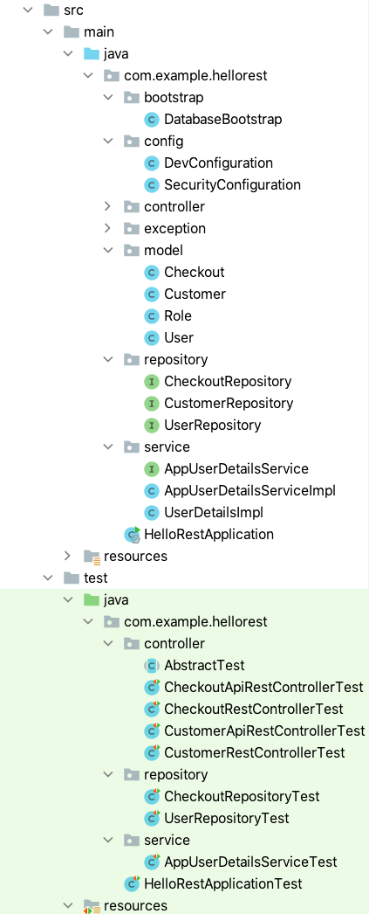

# Security-Step-2: Secure the endpoints with JWT Authentication

[Go to profiles branch](https://github.zhaw.ch/bacn/ase2-spring-boot-hellorest/tree/security-step-1)

The **securtiy-step-2 branch** has been created from the **securtiy-step-1 branch**.

The **step 2** is providing a **complete solution** for securing the endpoints with JWT Authentication

 

**Add new Unit Tests**

 

##  Project Structure for Security Step 2

 

